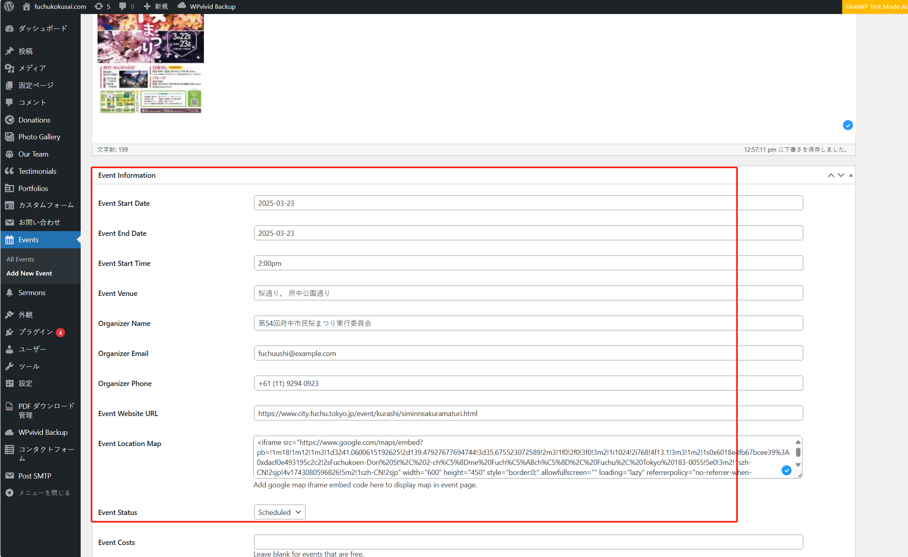
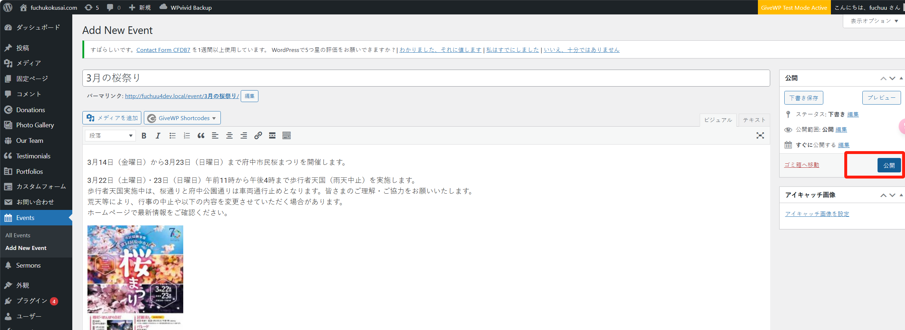

## イベントの作成

step 1：管理画面に入り、イベントを作成します：

step 2：「Add New Event」ボタンをクリックすると、イベント作成ページに移動します。まず、イベント名と説明文を入力します：

必要に応じて、ポスターや画像を挿入することもできます：

step 3：イベントの日付、開始時間、開催場所、担当者の連絡先、地図などの重要な情報を入力します：

step 4：地図情報の設定については、[google map](https://map.google.com/)のウェブサイトで検索し、以下の動画を参考にしてください：

<video controls src="../images/20250327-1306-21.8589457.mp4" title="Title"></video>

情報の入力が完了したら、ページ右側の「公開」ボタンをクリックして公開します。

以上です。
