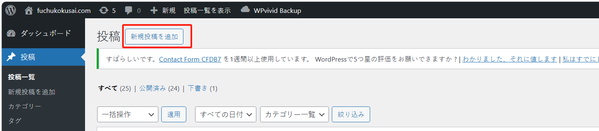
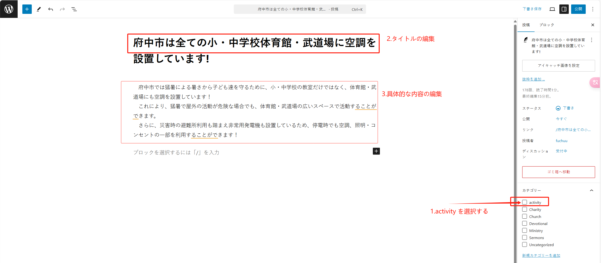
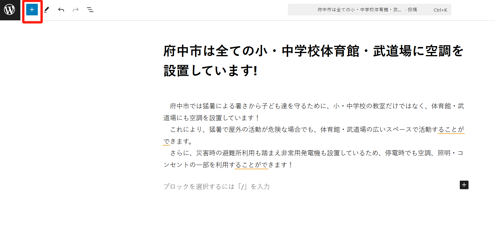
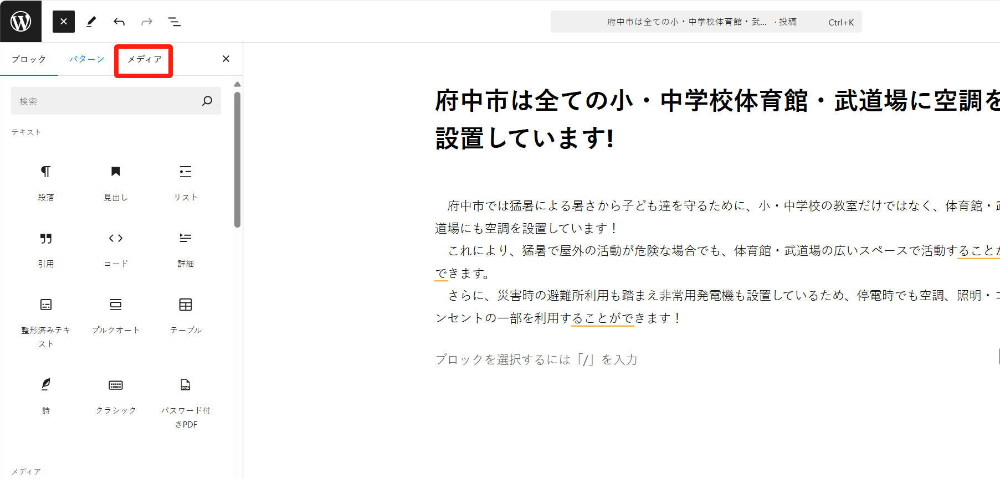
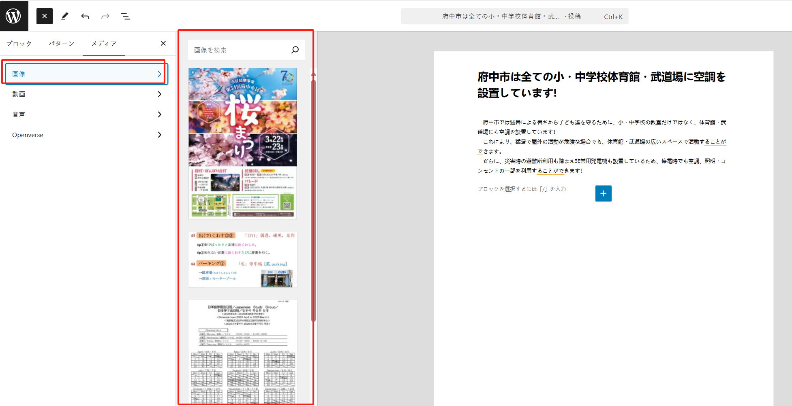
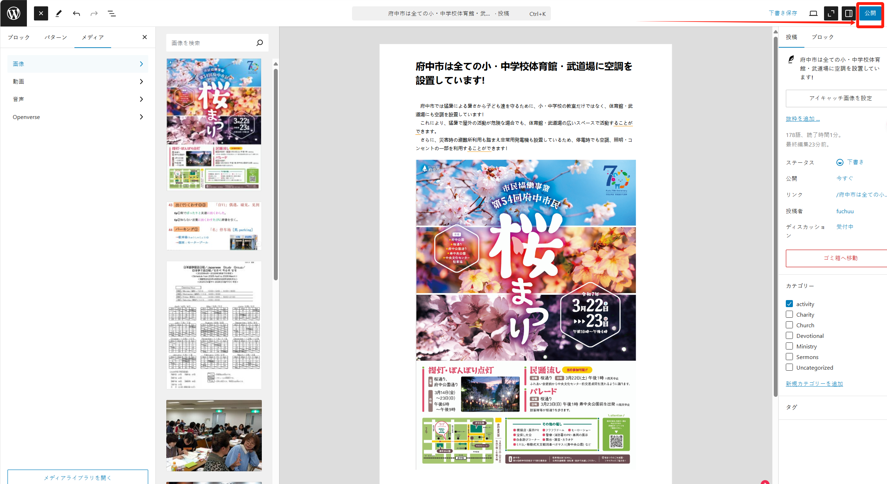
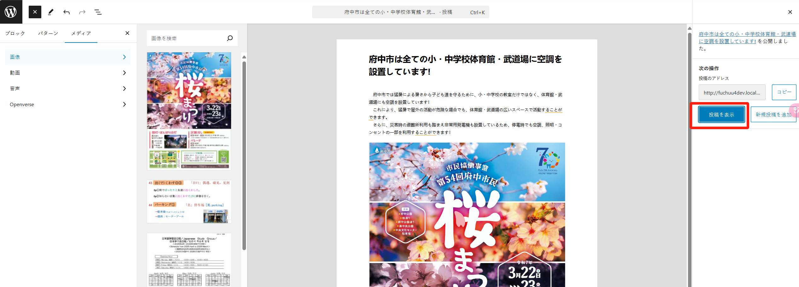
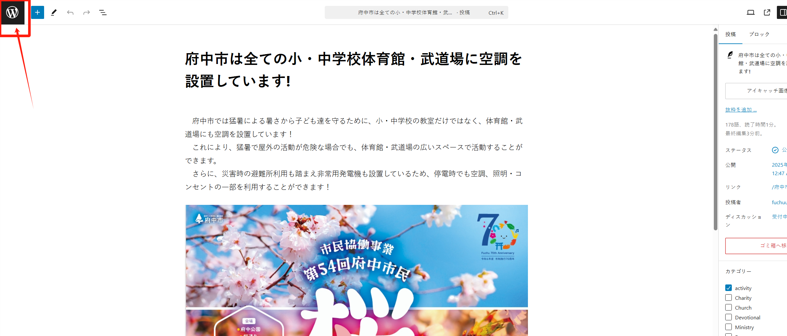

## 記事（post、activity）の作成

ウェブサイトのコンテンツ管理は主に記事を指し、WordPress では「post」と呼ばれています。サイト上では「activity」ページとして表示されます（実際には activity は post のカテゴリーの一つです）。

activity の作成手順は以下の通りです：

ステップ 1：管理画面に入り、「投稿」メニューをクリックしてページに移動します：

ステップ 2：「新規投稿を追加」ボタンをクリックして activity の作成を開始します：

ステップ 3：内容を編集し、activity カテゴリーを選択し、タイトルと詳細な内容を入力します：

「+」ボタンをクリックして、画像などのメディアコンテンツ（画像、動画、音声など）を追加できます：

必要に応じて画像または動画を選択します：

内容の編集が完了したら、「公開」ボタンをクリックして公開します（確認ステップがあり、もう一度「公開」ボタンをクリックする必要があります）：

公開後、右側の「投稿を表示」ボタンをクリックして、最終的な activity ページ（読者が見るページ）を確認できます。

activity 記事に修正が必要な場合は、修正後に再度公開することができます。

最後に、左上の「W」ボタンをクリックすると、管理画面に戻ることができます：

