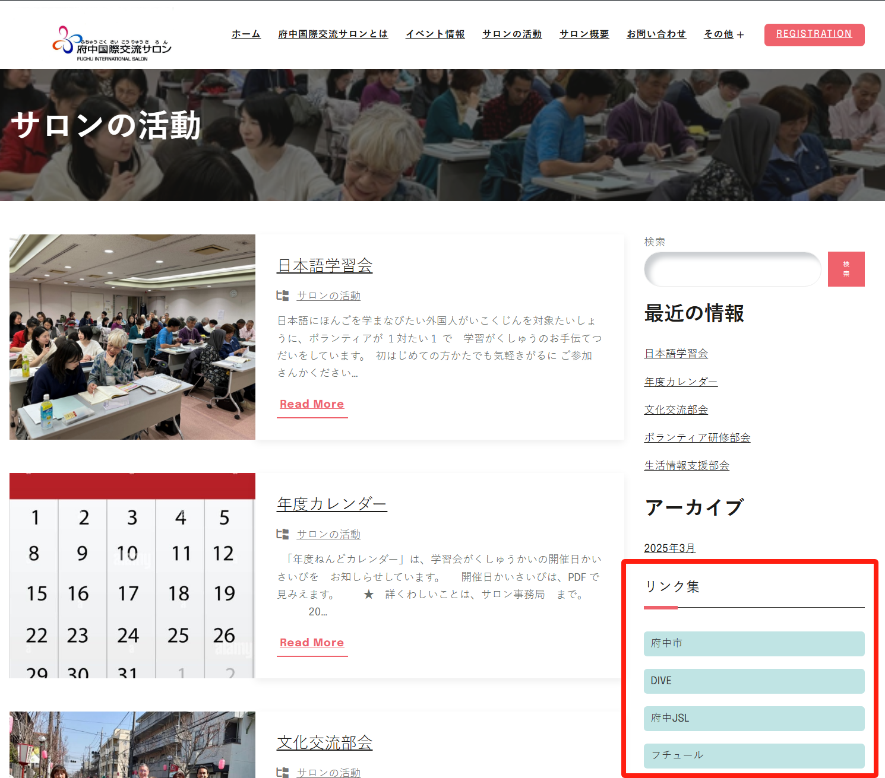
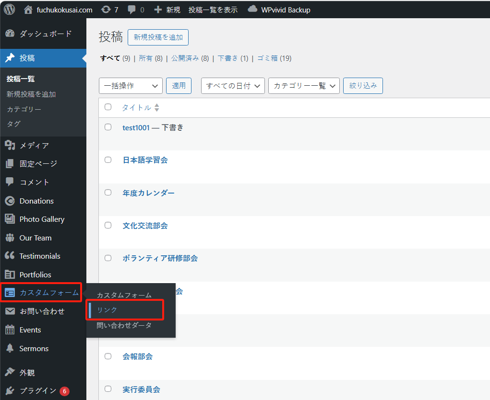

## リンク管理について

「リンク」は、コンテンツ表示ページの右側に配置されているリンク集です。以下の領域に表示されます：

新規追加、編集、順序の調整などの変更が必要な場合は、管理システムの「カスタムフォーム」メニューにある「リンク」サブメニューにアクセスしてください：

### 新規追加

「新規リンク追加」ボタンをクリックすると、新規追加画面が開きます：

「名称」と「URL」を入力し、「保存」ボタンをクリックすると完了です。

## 編集

リンクや表示テキストを修正したい場合は、該当する「編集」ボタンをクリックして編集することができます。

注意点：リンクの数は多すぎないようにしてください。**10 個**を超えないことをお勧めします。
