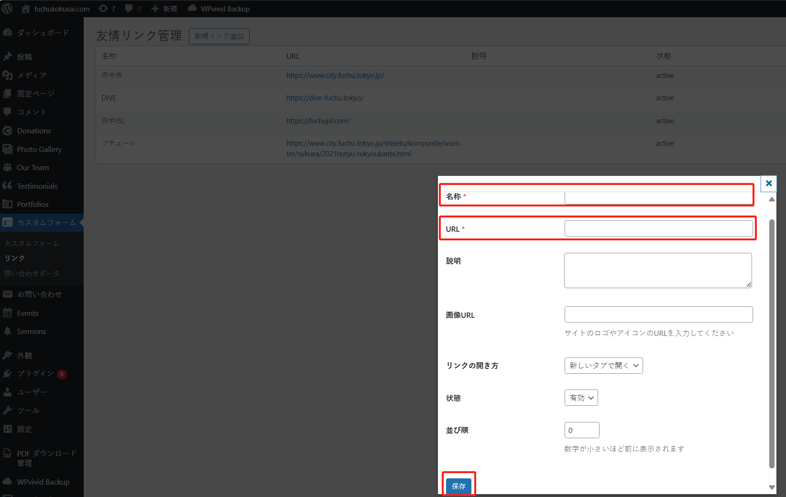
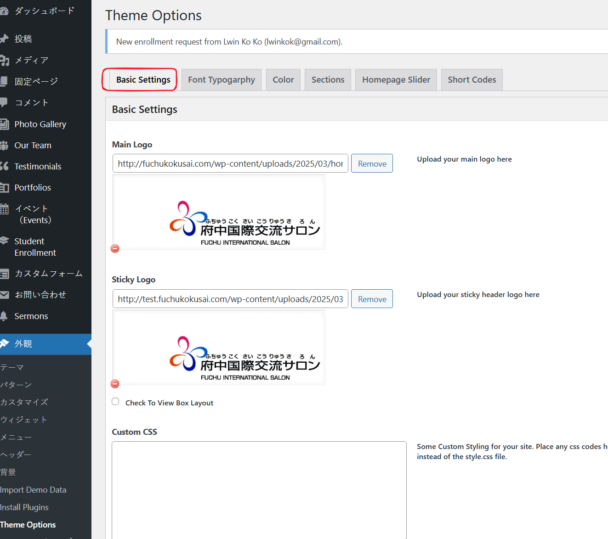
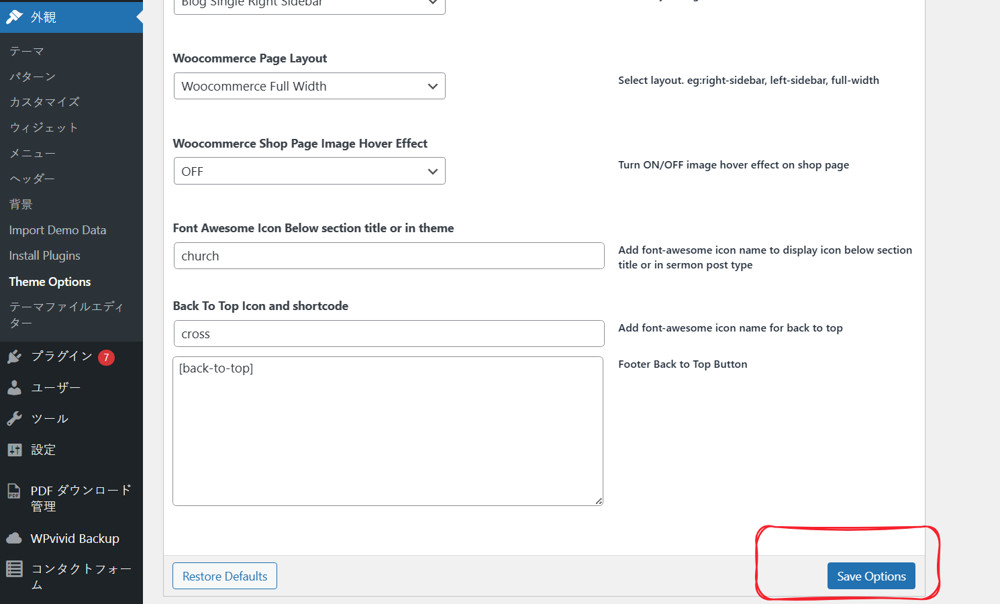

# リンクの修正

## サイドバーのリンク

「リンク」はコンテンツ表示ページの右側に表示されるリンク集です。下記の領域に表示されます：

新規追加、修正、順序調整などの変更が必要な場合は、管理システムの「カスタムフォーム」メニューの「リンク」サブメニューにアクセスしてください：

### 新規追加

「新規リンク追加」ボタンをクリックして、新規追加画面を開きます：

「名称」、「URL」を入力し、「保存」ボタンをクリックして完了します。

### 修正

リンクや表示テキストを修正したい場合は、該当する「編集」ボタンをクリックして編集してください。

注意：リンクの数が多すぎないようにしてください。**10**個以下を推奨します。

## ページフッターのリンク
すべてのページのフッターにもリンクが表示されています：

このリンク表示を修正する場合は、WordPress管理画面の「外観」>「Theme Options」にアクセスしてください：

「Basic Settings」タブを選択します：

以下の設定項目を探します：

修正が完了したら、ページ最下部の「Save Options」ボタンをクリックして保存します。

