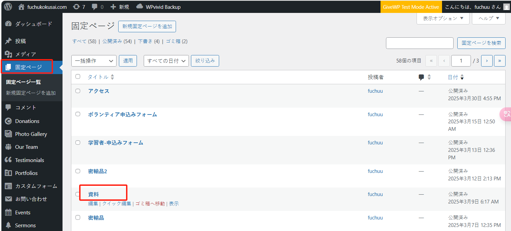
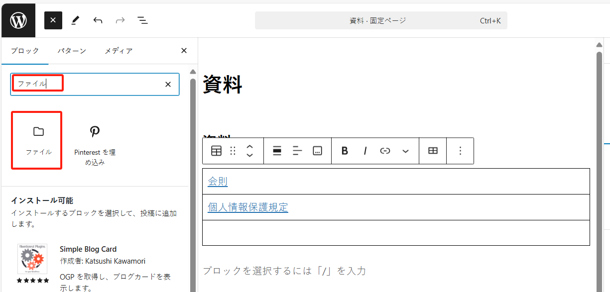
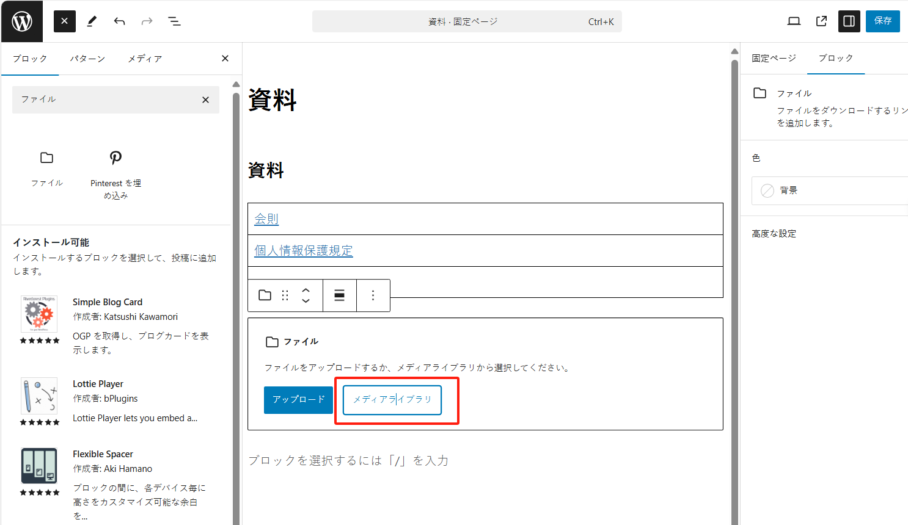
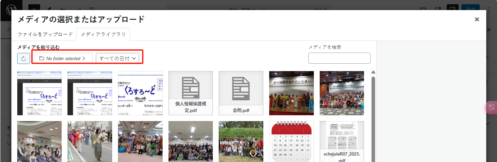
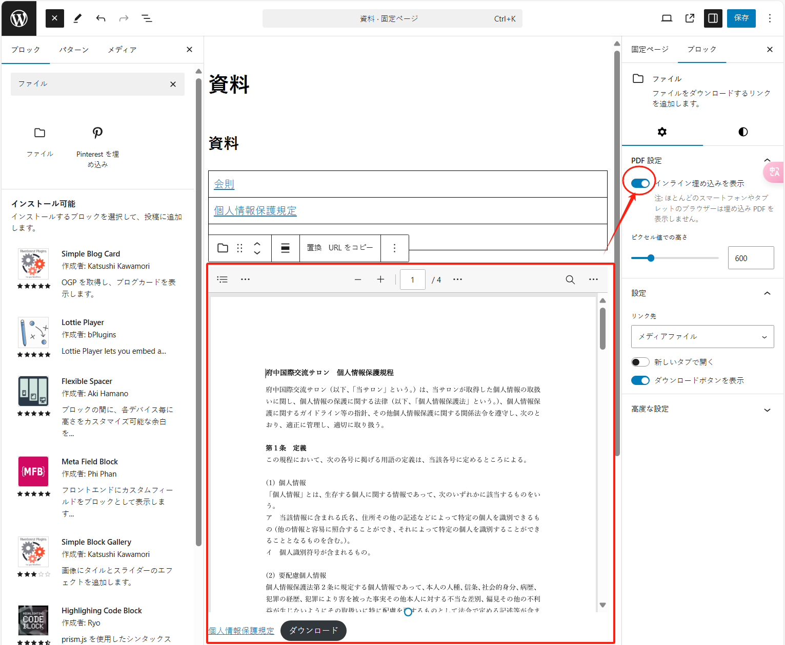
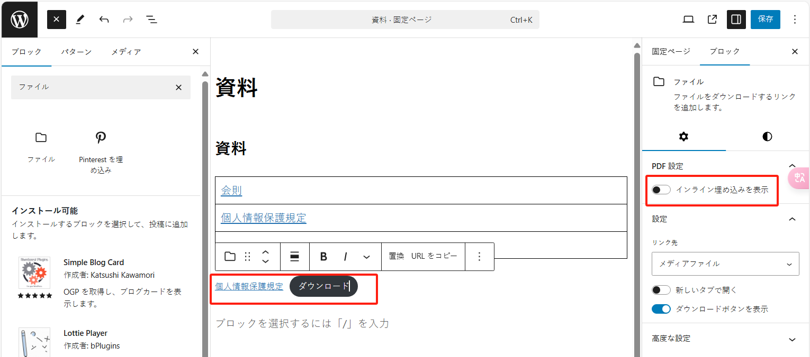

「資料」ページには、「府中国際交流サロン」組織に関する様々な資料が掲載されており、ユーザーがダウンロードできるようになっています。

新しい PDF ファイルを「資料」ページに追加するには、以下の手順に従ってください：

「固定ページ」メニューに入り、「資料」というページを検索します：

次に、「編集」に入り、ページ左上の「+」ボタンをクリックします：

「ファイル」コンポーネントを検索して選択します：

「メディアライブラリ」をクリックしてメディアライブラリに入り、適切な PDF ファイルを選択します：

メディアライブラリのファイルが多い場合は、フォルダーや日付で絞り込むことができます：

ファイルを選択したら、右下の「選択」をクリックして確定します：

デフォルトではファイルのプレビューが埋め込まれますが、必要ない場合は「インライン埋め込みを表示」オプションをオフにすることで、リンクのみが表示されます：

最後に、右上の「保存」ボタンをクリックします：

以上で完了です。
