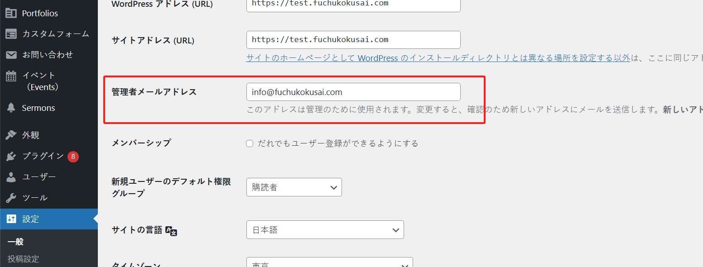
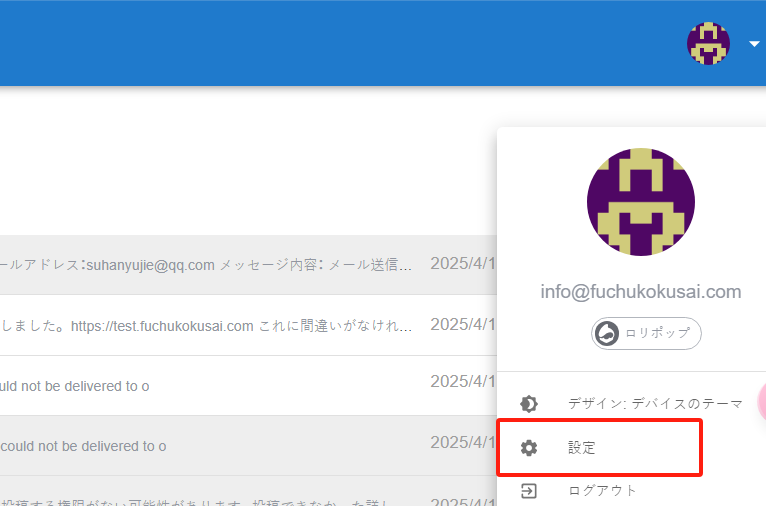

# 「お問い合わせ」メール受信設定

ユーザーがフロントページで「お問い合わせ」フォームに記入して送信すると、管理者はメールを受信し、返信することができます。

メール送信の経路は：WordPress サーバー -> lolipop メールサーバー -> 複数の管理者メールボックスとなります。

図に示されているように、「route1」の設定は「設定」メニューにあります：

ユーザーが「お問い合わせ」を送信すると、このメールアドレスに通知メールが送信されます。図に表示されているのは lolipop が提供するメールアドレスで、https://webmail.lolipop.jp/ からログインできます。

lolipop メールには転送機能があり、受信したメールを複数の管理者メールアドレスに転送することができます。これが route2 に対応するプロセスです。転送先のメールアドレスはログイン後に設定できます。

lolipop メールにログインしたら、右上の設定ボタンをクリックします：

スクリーンショットを参考に、新しい管理者メールアドレスを自由に追加することができます。
