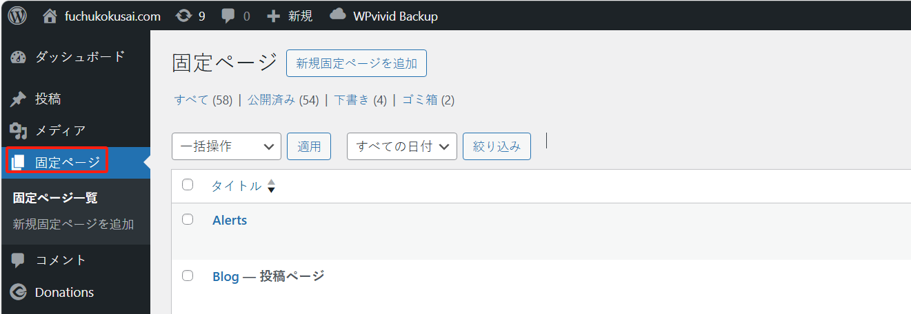
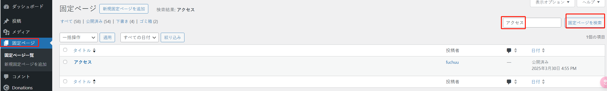
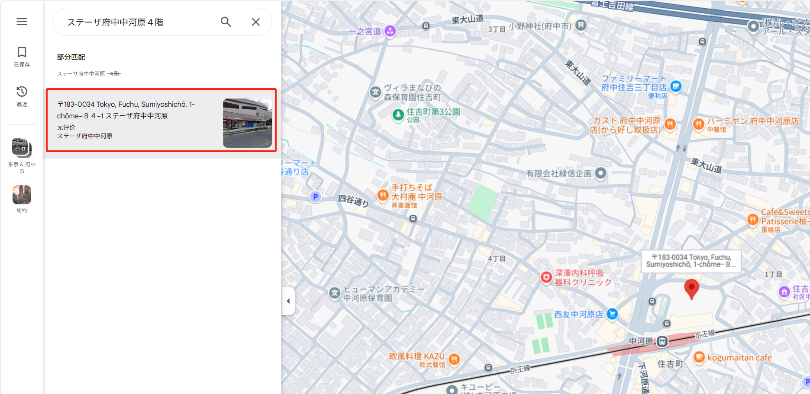
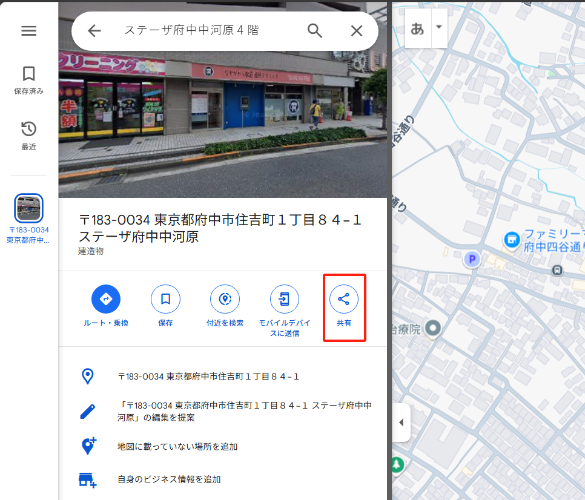

## 「アクセス」

このページは「固定ページ」メニューにあります：

「ページ」が多い場合は、キーワード「アクセス」で関連ページを検索できます：

タイトルをクリックして編集ページに入ります：

### 地図の修正

地図を修正する場合は、以下の手順に従ってください：

1. [Google マップのウェブサイト](https://www.google.com/maps)にアクセスします

2. 新しい住所を検索します。例：`ステーザ府中中河原４階`

2.1 検索結果の住所をクリックします：

3. 「共有」ボタンをクリックします

3.1 「地図を埋め込む」タブを選択します：

3.2 「HTML をコピー」ボタンをクリックします：

4. ページ編集画面に戻り、コピーした内容を指定の場所に貼り付けます：

5. 「保存」ボタンをクリックして完了です

