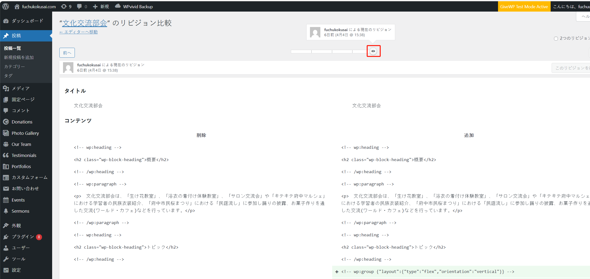
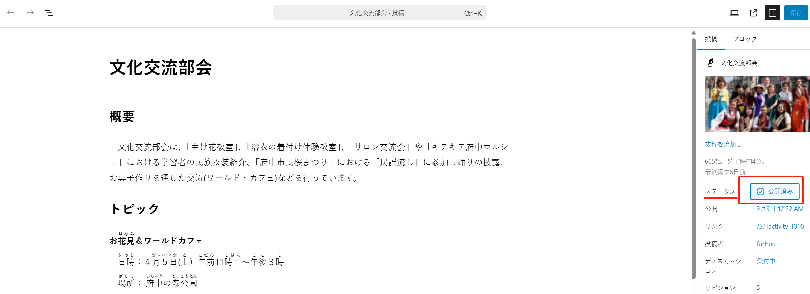
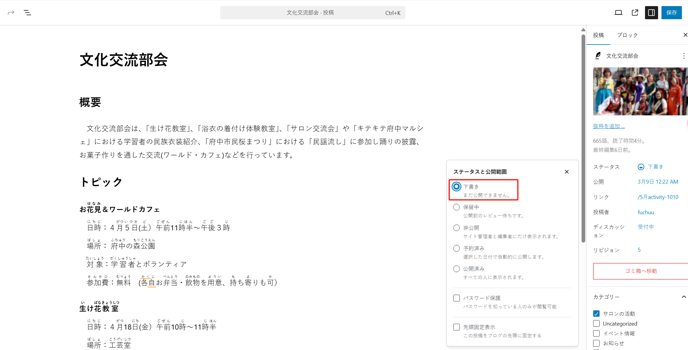

## 「文化交流部会」

このページは「投稿」メニューにあります：

記事が多い場合は、キーワード「文化交流部会」で関連記事を検索できます：

記事の内容を編集することができます：

### 変更履歴の確認

誤って記事の内容を変更してしまった場合や、過去のバージョンに戻したい場合は、右側の「リビジョン」の履歴記録をクリックします：

スライダーを動かすことで、自由に変更履歴を確認し、過去のバージョンに簡単に戻すことができます：

確定したら、「このリビジョンを復元」ボタンをクリックして確認します：

変更を加えたくない場合は、「エディターへ移動」リンクをクリックしてエディターに戻ることもできます：

### 公開を取り消す

コンテンツの準備が整っていない場合は、一時的に公開を取り消すことができます。右側の「ステータス」をクリックして切り替えます：

「下書き」に切り替えて「保存」をクリックすると、ユーザーはこの記事を見ることができなくなります。

