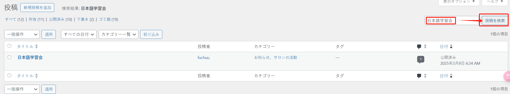
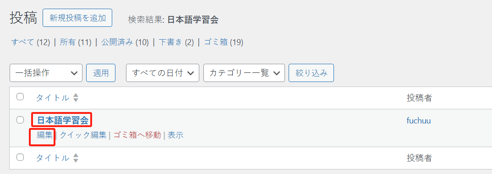

## 「日本語学習会」

このページは「投稿」メニューにあります：

記事が多い場合は、キーワード「日本語学習会」で関連記事を検索できます：

記事の内容を編集することができます：

### 記事のカテゴリー

記事を編集する際、右側の「カテゴリ」をチェックすることで記事を分類することができます。一つの記事を複数のカテゴリーに分類することも可能です：

### アイキャッチ画像

記事を編集する際、右側の「アイキャッチ画像を設定」ボタンをクリックすることで、記事にカバー画像を追加できます。これにより、記事一覧がより見やすくなります：

アイキャッチ画像を設定すると、一覧表示が見やすくなります：

