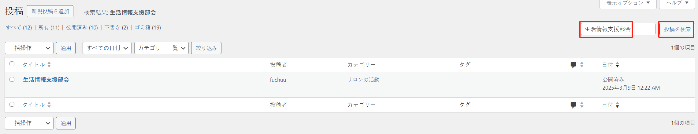
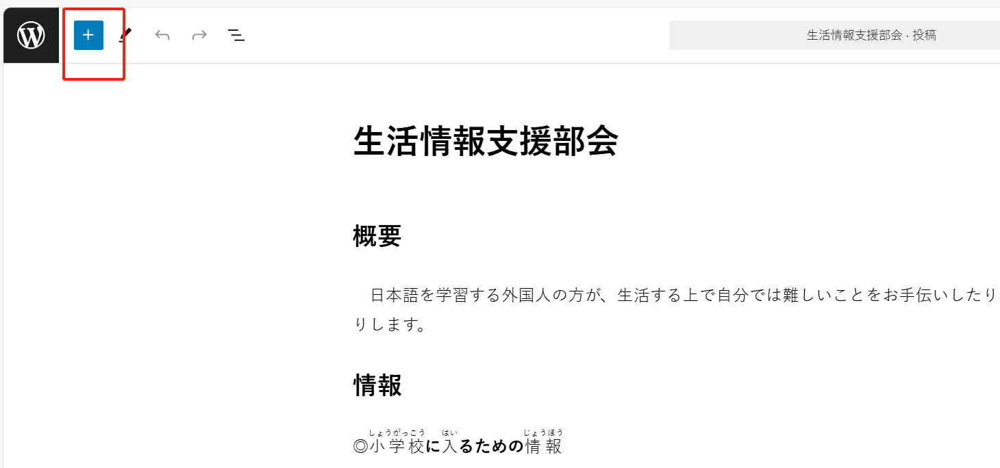
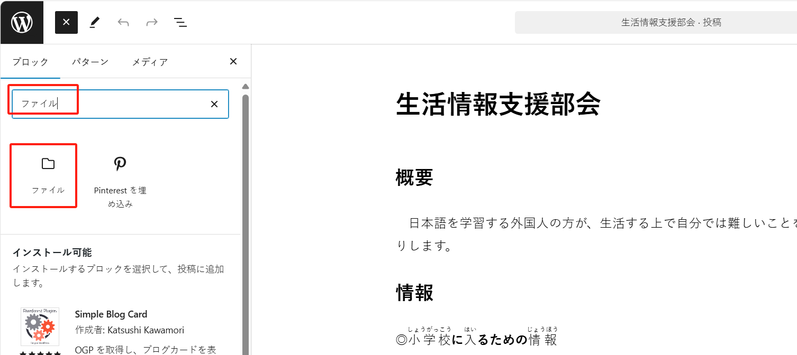
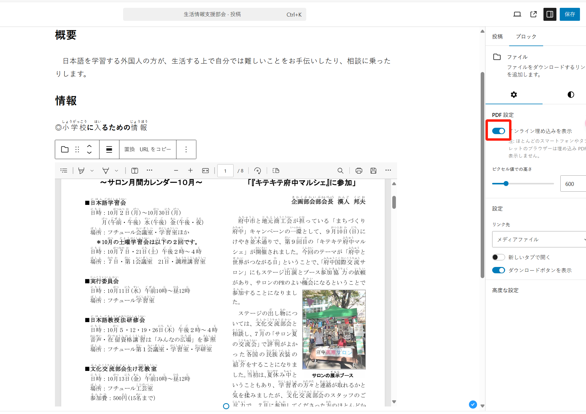
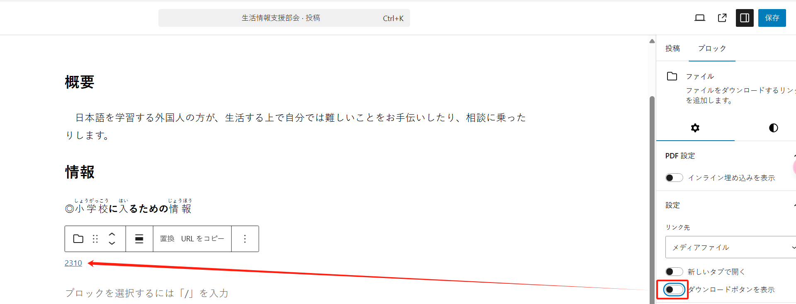
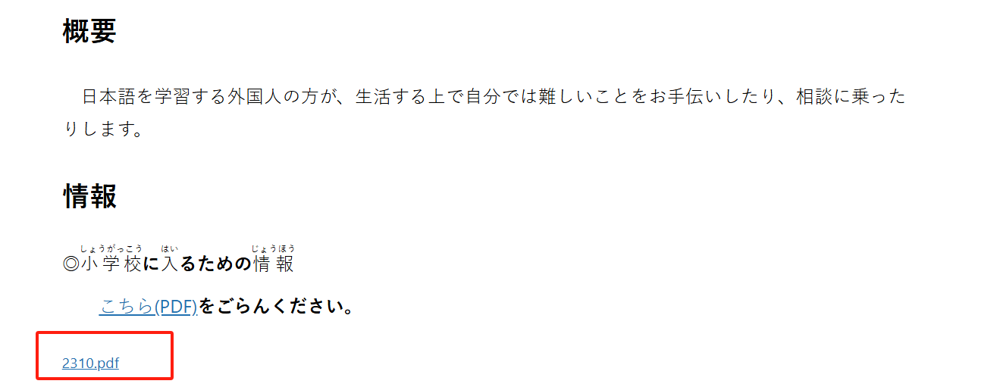
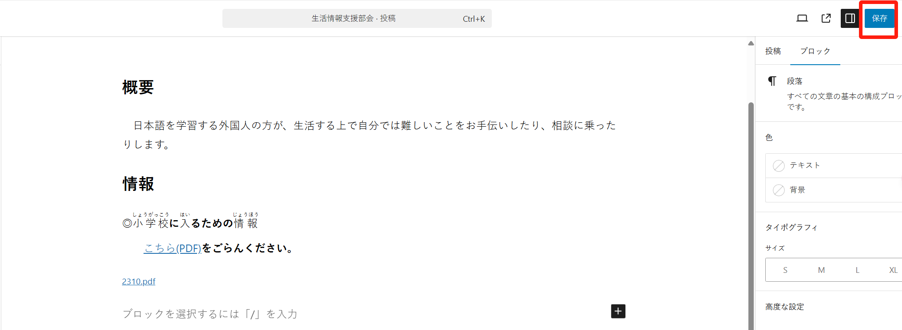

## 「生活情報支援部会」

このページは「投稿」メニューにあります：

記事が多い場合は、キーワード「生活情報支援部会」で関連記事を検索できます：

タイトルをクリックすると、編集ページに移動します：

### ページに PDF ファイルのリンクを追加する

2 つの方法があります：

#### 方法 1

メディアライブラリからファイルを追加します。左上の「+」ボタンをクリックします：

「ファイル」ブロックを探します：

「メディアライブラリ」ボタンをクリックし、必要なファイルを選択します：

ファイルを選択したら、「選択」ボタンをクリックして確定します：

右側のツールバーを開き、PDF の埋め込みを解除して、ダウンロードリンクのみを表示します：

「ダウンロード」ボタンを表示したくない場合は、ボタンをクリックして解除します：

これで PDF ファイルのダウンロードリンクのみが表示されます：

リンクの表示名を変更することもできます。例えば、`2310.pdf`に変更する場合：

最後に「保存」ボタンをクリックします。

#### 方法 2

「メディアライブラリ」でファイルを探し、その URL をコピーして、テキストのリンクとして設定することもできます。

特定のテキストを選択し、以下のように表示されるボタンをクリックします：

URL を貼り付けて、Enter キーを押します。

最後に「保存」ボタンをクリックします。

