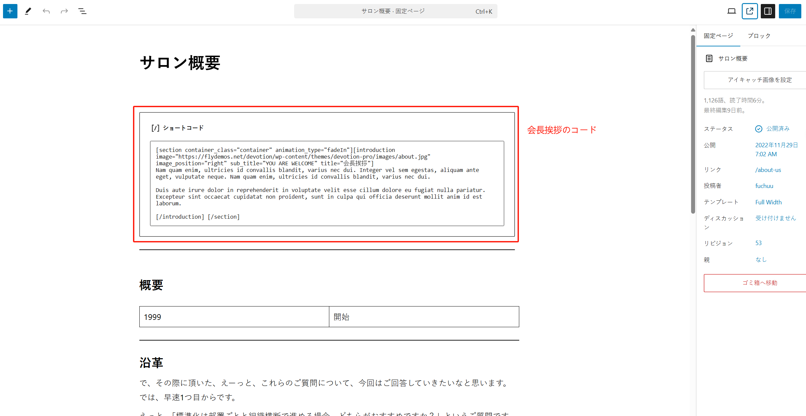
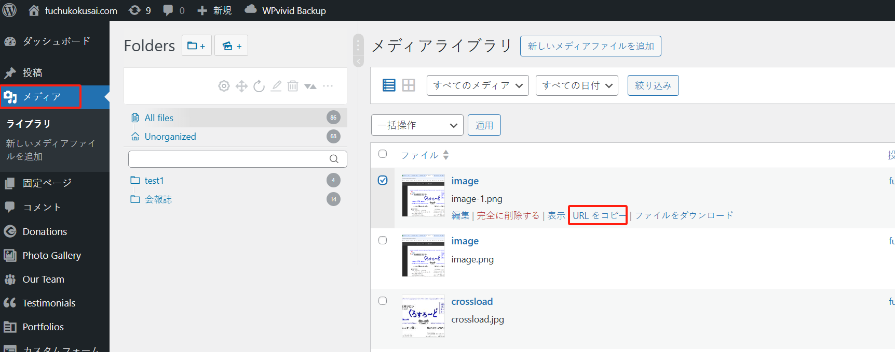
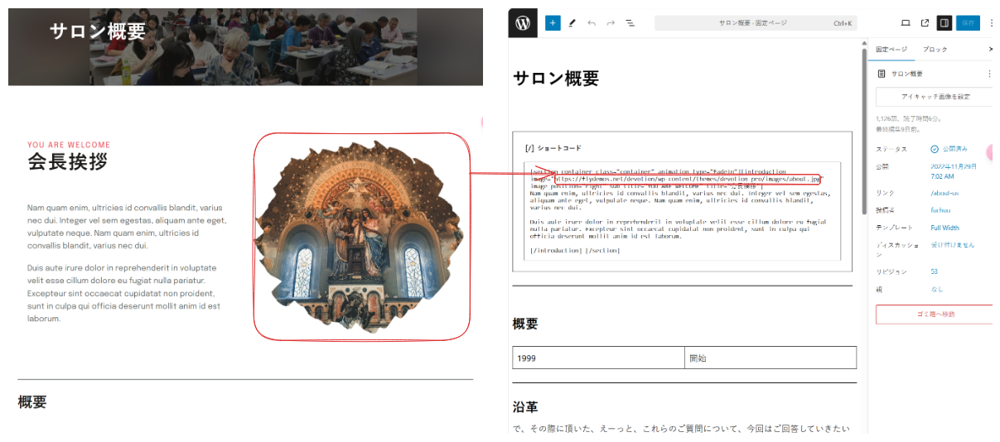
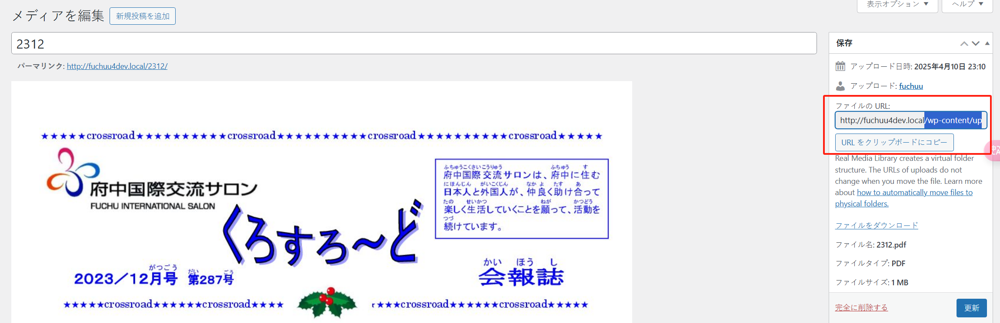

## 「サロン概要」

このページは「固定ページ」メニューにあります：

記事が多い場合は、キーワード「サロン概要」で関連記事を検索できます：

編集ページに移動します：

ページには以下の特別な部分があり、注意が必要です：

### 会長挨拶

この部分は「shortcode」によって生成されているため、コードが正しくないとページが正常に表示されません。内容を修正する際は特に注意が必要で、修正後は必ず効果を確認してください。ページが破損した場合は、編集を取り消して（過去のバージョンに戻すことができます）ください。

「会長挨拶」の内容部分は、以下の図のようにコードで示されています：

内容は以下の図のように対応しており、位置に従って内容を修正することができます：

#### 画像の修正

この部分の画像は以下の手順で修正できます：

1.まずメディアライブラリから目的の画像を見つけ、画像の URL をコピーします：

2.画像の URL を以下の位置に貼り付けます（注意：内容の両側の二重引用符（`"`）は残してください）：

（注意：内容の両側の二重引用符（`"`）は残してください）修正後、確認してください：

### 会報誌

新しい「会報誌」が作成され、ページにリンクを追加する必要がある場合は、以下の手順を参考にしてください：

1.まず PDF ファイルを「メディアライブラリ」にアップロードします：

1.1 ファイルの編集モードに入ります：

1.2 ファイルの URL をコピーします：

1.2.1 （オプション）実は最適な方法は、コピーした URL にドメイン部分を含めないことです：

例えば、コピーした URL が：`http://fuchuu4dev.local/wp-content/uploads/2025/04/2312.pdf`

（ドメイン部分は`http://fuchuu4dev.local`）の場合、この部分だけをコピーします：`/wp-content/uploads/2025/04/2312.pdf`

こうすることで、将来サイトのドメインが変更された場合でもファイルにアクセスできなくなる問題を防ぐことができます。（この操作が難しい場合は、URL を全てコピーしてください。）

2. マウスで文字を選択し、文字にリンクを追加します：

2.1 ステップ 1 でコピーした画像 URL を以下の位置に貼り付けます（その後、Enter キーを押して確定します）：

これでリンクの追加は完了です。最後に右上の「保存」ボタンをクリックして、ページの内容を保存します。

