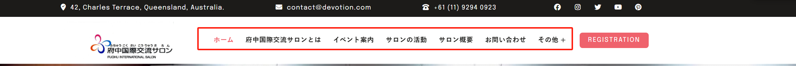
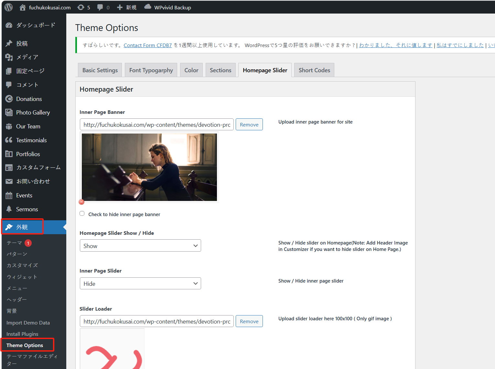
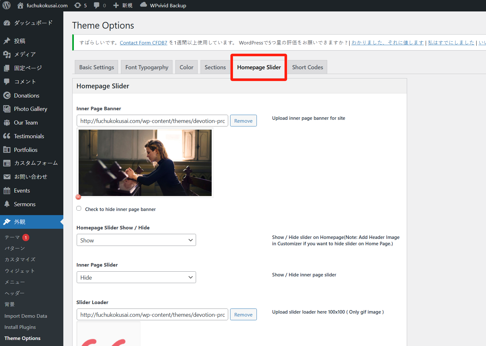
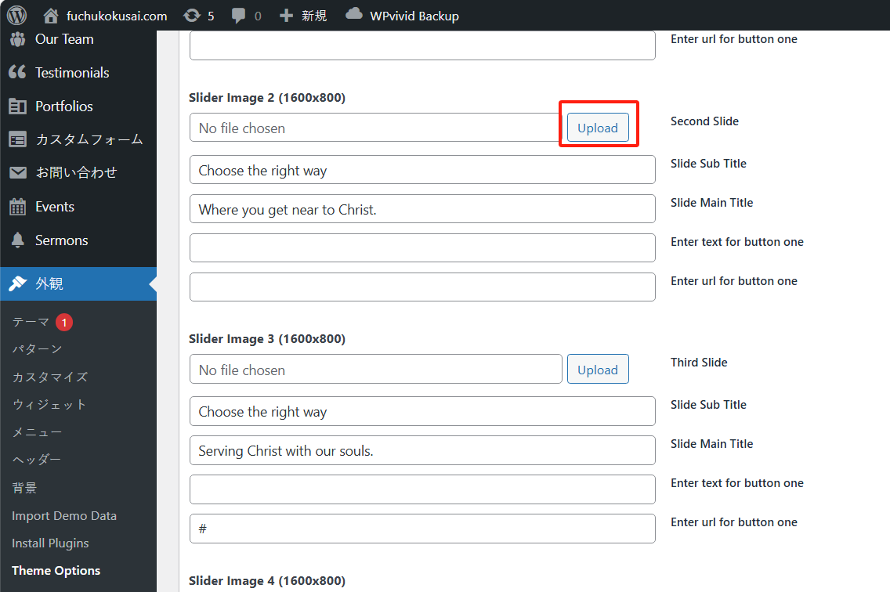
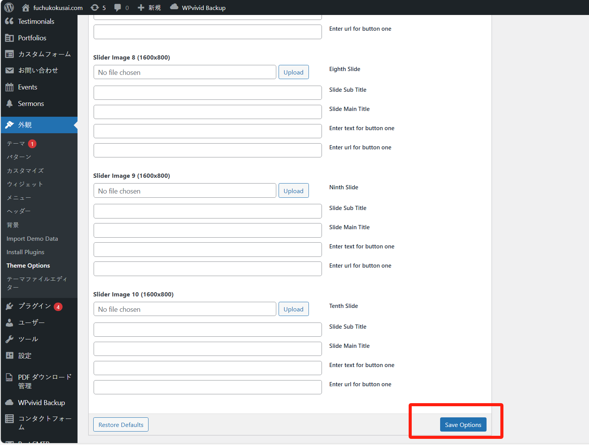

## ウェブサイトのホームページの修正

現在のホームページは devotion theme の shortcode をベースにカスタマイズされています。このプロセスについて詳しく知りたい場合は、[公式ドキュメント](https://flydemos.net/docs/devotion-doc/)を参照してください。ホームページの shortcode コードページは「固定ページ」>「mySamplePage1001」ページにあります。

既存のホームページについて、テキストや画像の内容を簡単に修正したい場合は、以下の手順を参考にしてください：

### ホームページメニューの修正

メニューのテキスト、リンク、順序の変更、新しいリンクの追加などを行いたい場合は、以下のように編集ページに入ることができます：

「Primary Menu」マークの付いたメニューを選択していることを確認してください（このマークがあるということは、ホームページのメニューであることを示しています）：

この時点で、修正対象のメニューが下に表示されます：

順序を変更したい場合は、menu item をマウスでドラッグ＆ドロップするだけで簡単に変更できます。

リンクやテキストを修正する場合は、右側の矢印ボタンをクリックします：

修正が完了したら、下の「メニューを保存」ボタンをクリックします。

### ホームページのスライダー画像の修正

ホームページでは、複数の大きな画像を表示し、テキストやリンクを追加することができます：

修正を行うには、管理画面の「外観」>「Theme Options」に移動します：

「Homepage Slider」ページに移動します：

「Slider Image」設定エリアを見つけます：

不要な画像は「Remove」ボタンをクリックして削除できます：

新しい画像を使用したい場合は、「Upload」ボタンをクリックします：

メディアライブラリに画像がない場合は、「ファイルをアップロード」ボタンをクリックして新しい画像をアップロードできます：

次に、ホームページのスライダー画像として使用したい画像を選択し、「選択」ボタンをクリックします：

最後に、ページ下部の「Save Options」ボタンをクリックして保存します！

