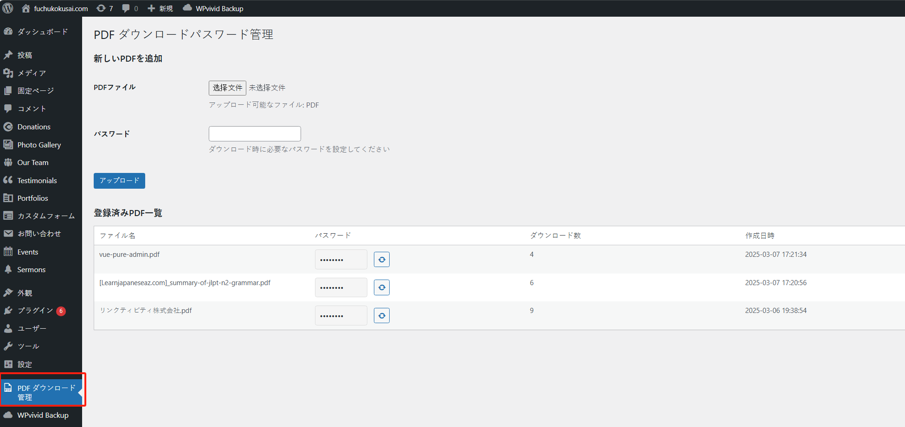
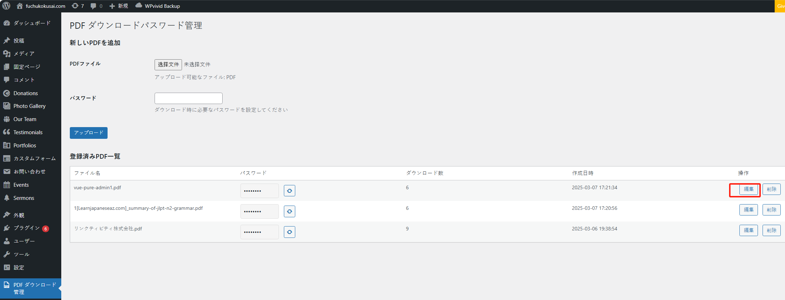

パスワード付き PDF ファイルの一覧ページは、メニューの「その他」>「資料（パスワード付き）」から閲覧できます。

PDF ファイルの追加や削除が必要な場合は、以下の手順を参照してください。

## 新規追加

管理システムにて、「PDF ダウンロード管理」メニューをクリックします：

アップロードしたい PDF ファイルを選択し、パスワードを入力した後、「アップロード」ボタンをクリックすると、新規追加が完了します。

## 編集

編集したい PDF ファイルを確認し、「編集」ボタンをクリックすると、ファイル名とパスワードを編集することができます。

## 削除

削除したい PDF ファイルを確認し、「削除」ボタンをクリックすると、PDF ファイルを削除することができます。

