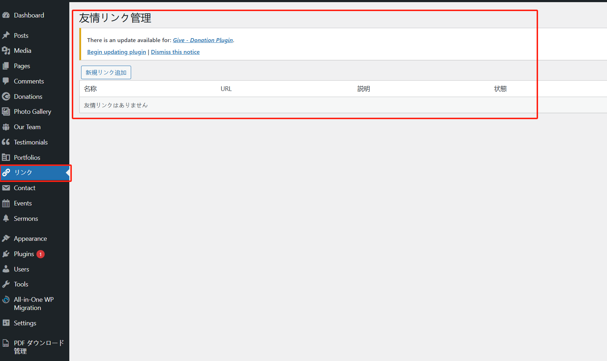

## プラグインのインストール

[コードリリースページ](https://github.com/suhanyujie/wp-link-gallery/releases)からプラグインの ZIP ファイルをダウンロードし、WordPress 管理画面のプラグインインストールページにアップロードして、有効化するだけです。

## プラグインの使用

プラグインをインストールして有効化すると、WordPress 管理画面の左側メニューに「リンク」メニュー項目が表示されます。

### 「リンク」の追加

「新規リンク追加」ボタンをクリックして、新しい友好リンクを追加します：

これで、記事ページの右サイドバーの下部に新しい友好リンクが表示されます：

