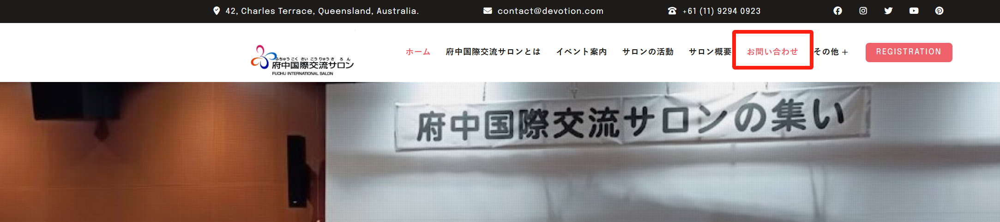
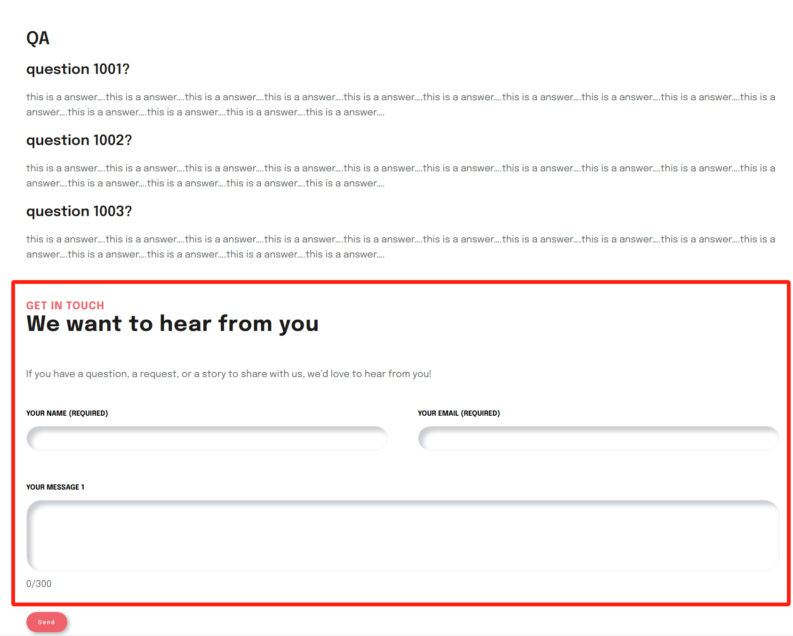
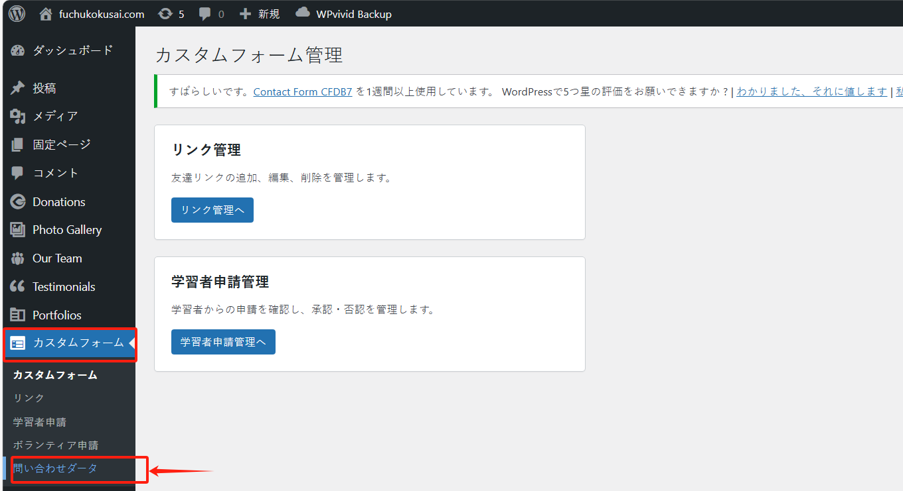
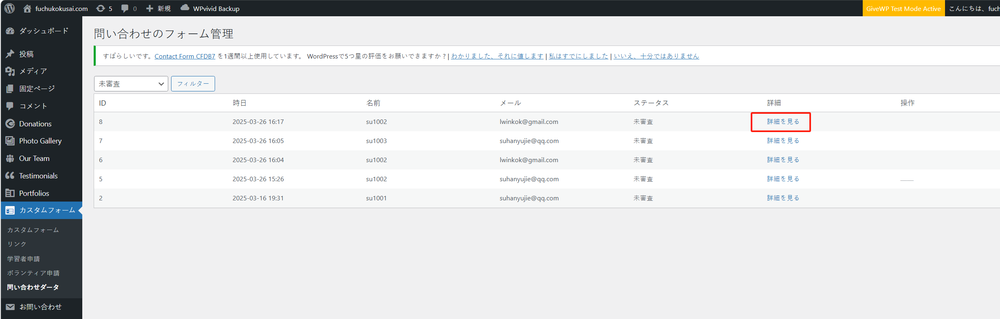
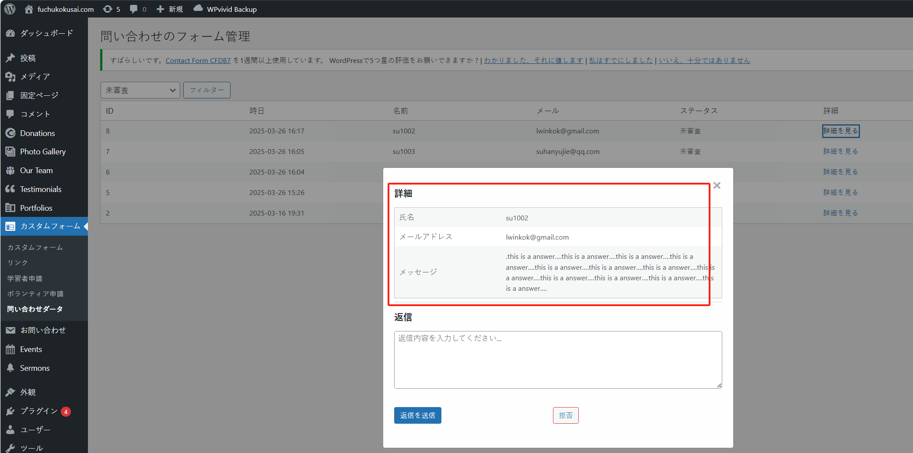
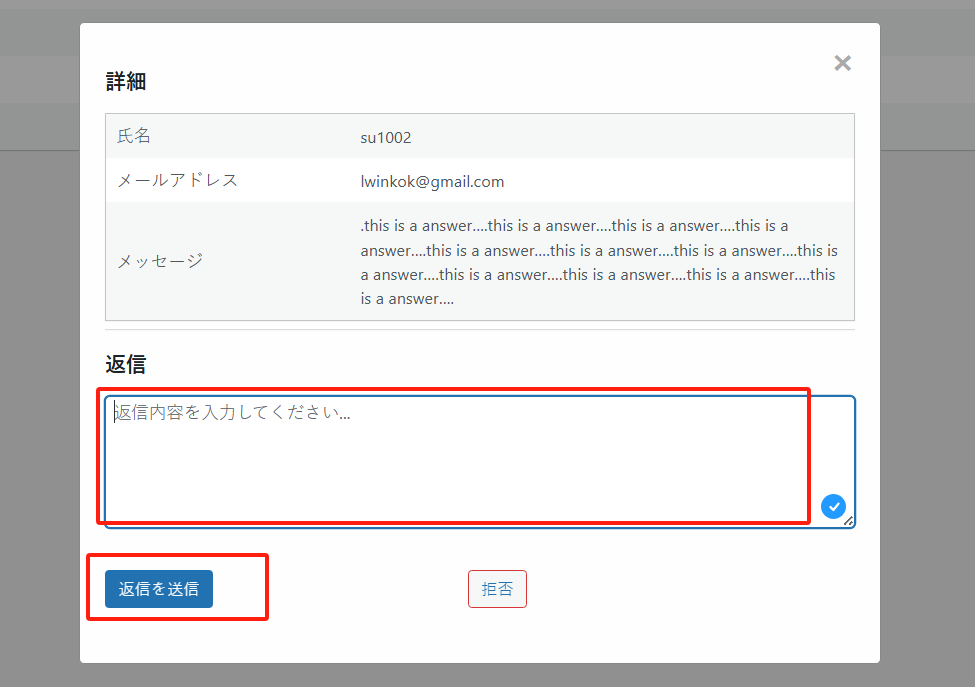
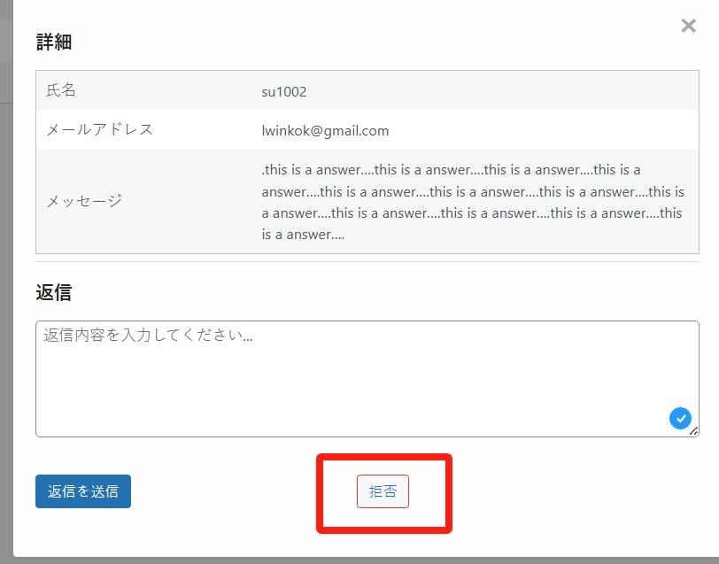

## ユーザーからの問い合わせやフィードバックの処理

「お問い合わせ」とは、ユーザーがウェブサイトの連絡手段（お問い合わせフォームやメールなど）を通じて、サイト管理者に送信する質問やフィードバックのことです。

当サイトにも関連ページがあり、以下のように、ボタンをクリックすることでお問い合わせページに移動できます：

ユーザーはフォームに記入して問い合わせを行うことができます：

ユーザーがフォームに記入を完了すると、サイト管理者は管理画面でユーザーから送信された問い合わせを確認し、返信することができます。

管理画面に入り、まず「カスタムフォーム」メニューをクリックし、次に「問い合わせデータ」メニューをクリックします：

ここでユーザーから送信された問い合わせ情報を確認できます。「詳細を見る」ボタンをクリックすると詳細情報が表示されます：

管理者は「返信」欄に返信内容を入力し、「返信 & 送信」ボタンをクリックすることで、問い合わせを送信したユーザーにメールを送信することができます。

無効な問い合わせの場合は、「拒否」ボタンをクリックして削除することができます：

