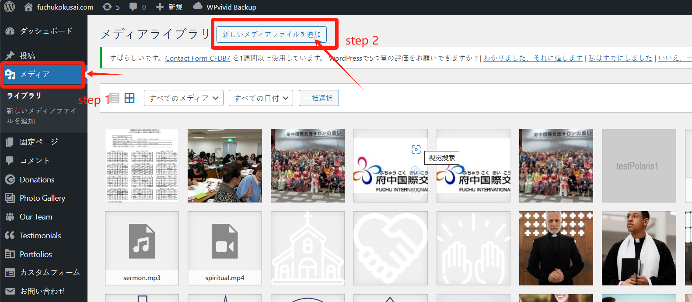
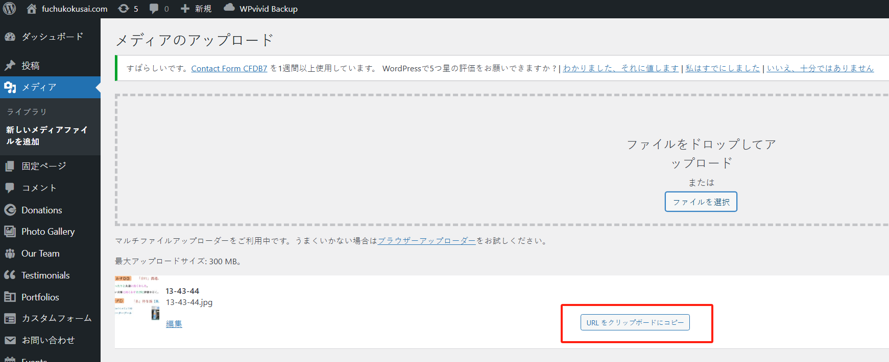
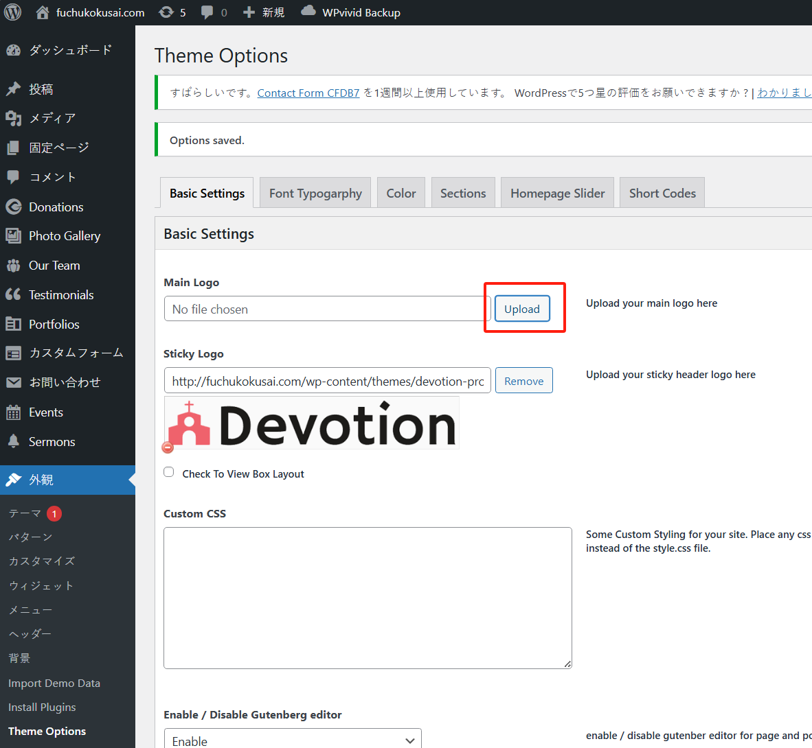
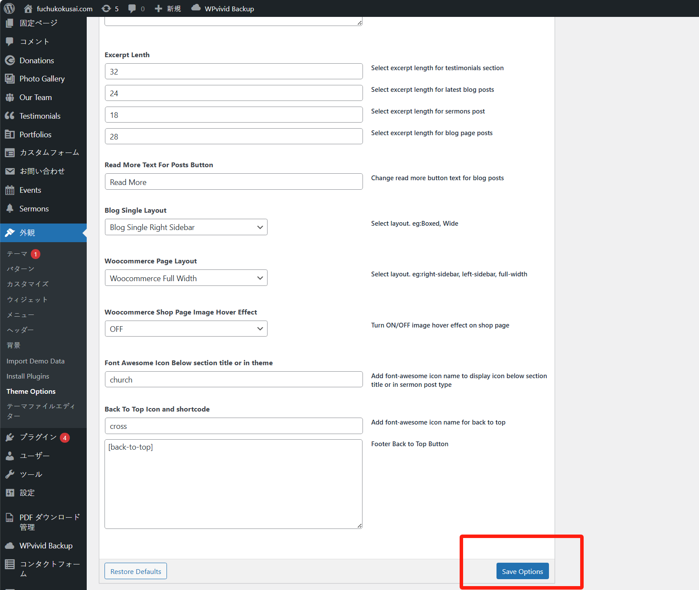

# 使用ガイド 1

## ウェブサイトのロゴ変更

ウェブサイトのロゴは、以下の位置に表示されています：

新しいロゴに変更する場合は、以下の手順で行うことができます。

step 1. 新しいロゴ画像を用意し、ホームページの管理画面にアクセスして、「メディア」メニューから「新しいメディアファイルを追加」ボタンをクリックします：

「ファイルを選択」ボタンをクリックして、新しいロゴファイルをアップロードします：

アップロードが完了したら、「URL をクリップボードにコピー」ボタンをクリックして画像 URL をコピーできます：

step 2. ホームページの管理画面で、「外観」>「Theme Options」メニューに移動し、「Basic Settings」ボタンをクリックします：

「Remove」ボタンをクリックして、古いロゴを削除します：

削除後、ボタンが「Upload」に変わります。この「Upload」ボタンをクリックします：

先ほどアップロードしたロゴ画像を見つけて選択し、「選択」ボタンをクリックします：

**最後に**、ページ下部にある「Save Options」ボタンをクリックして完了です。

