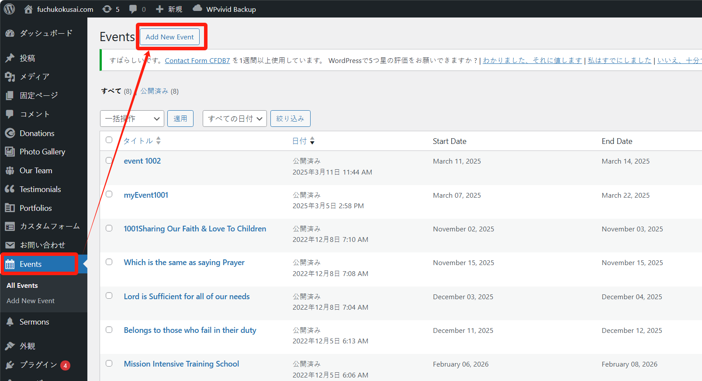
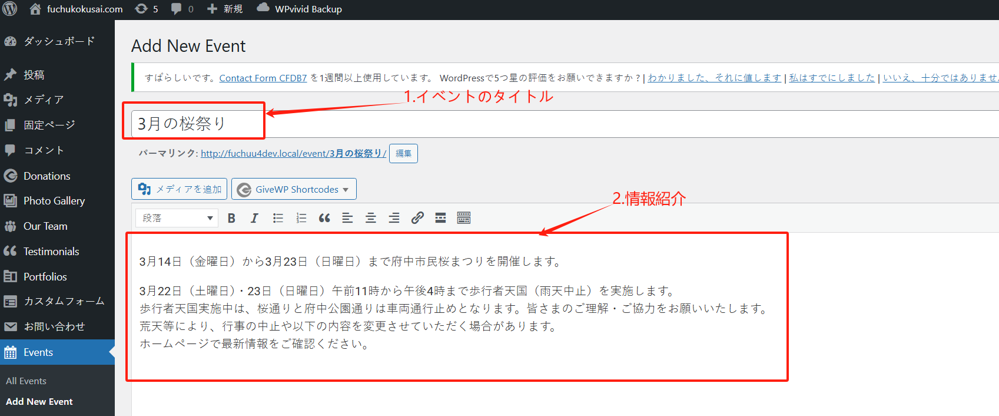
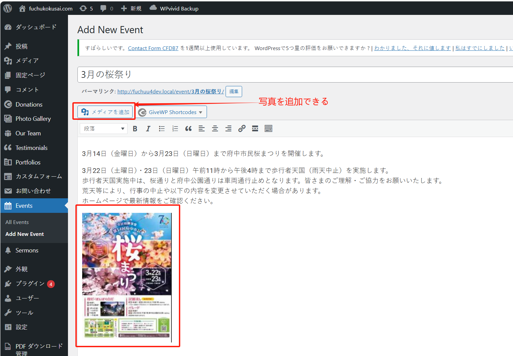
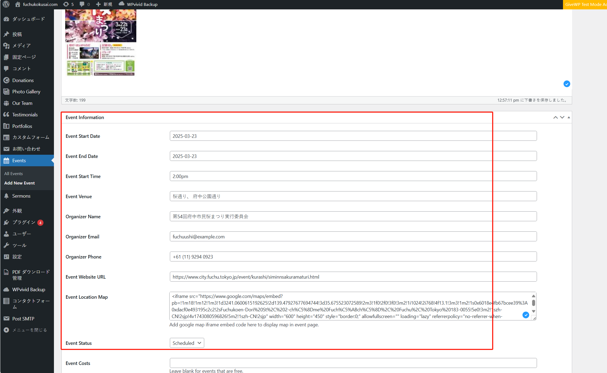
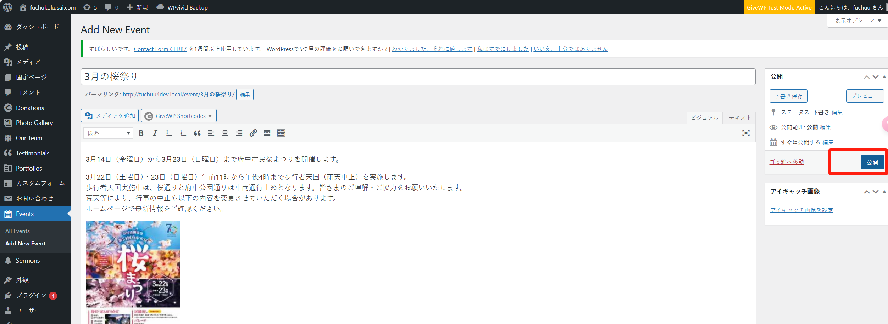

## 创建 event

step 1：进入后台管理页面，创建 event：

step 2：点击 “Add New Event” 按钮后，进入创建 event 页面，首先填写 event 名称，和介绍信息：

当然也可以插入合适的海报或者图片：

step 3：填写活动的日期、开始时间、活动地点、联系负责人、地图等重要信息：

step 4：其中，地图信息的设置，可以先从 [google map](https://map.google.com/) 网站中查找，参考下方视频：

<video controls src="../images/20250327-1306-21.8589457.mp4" title="Title"></video>

信息填写完成后，点击页面右侧的“公開”按钮进行发布。

以上。
