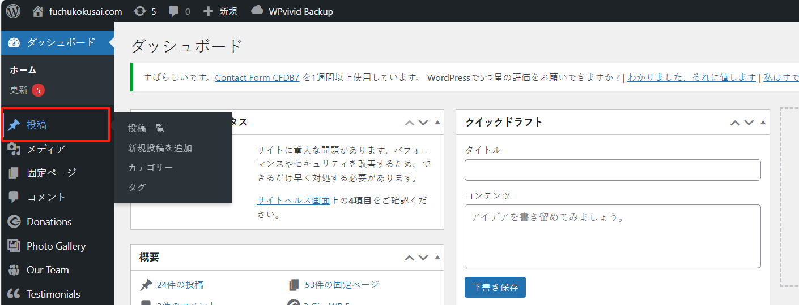
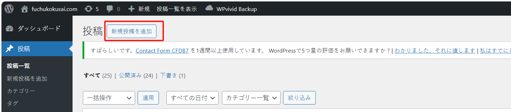
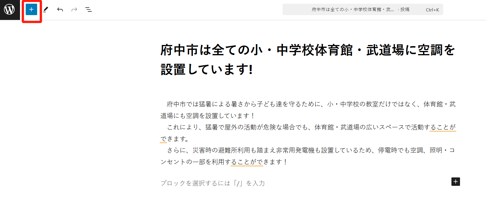
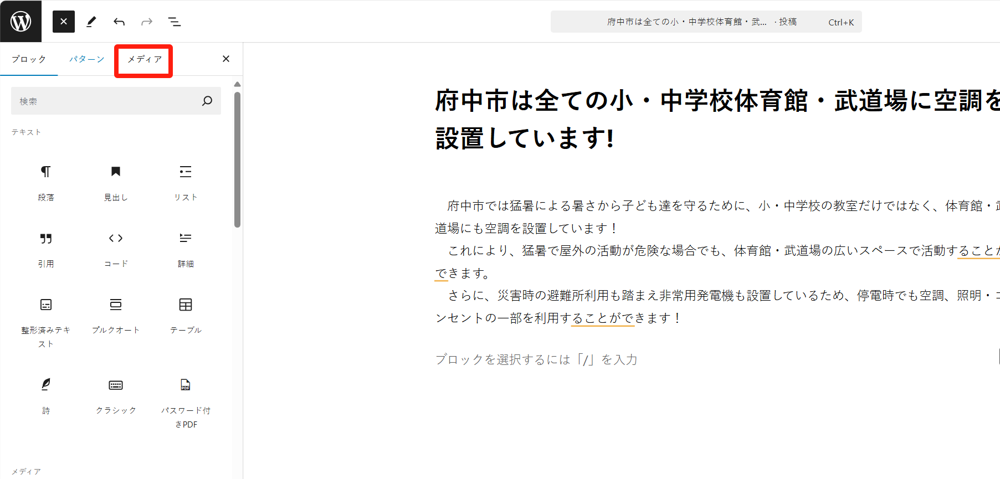
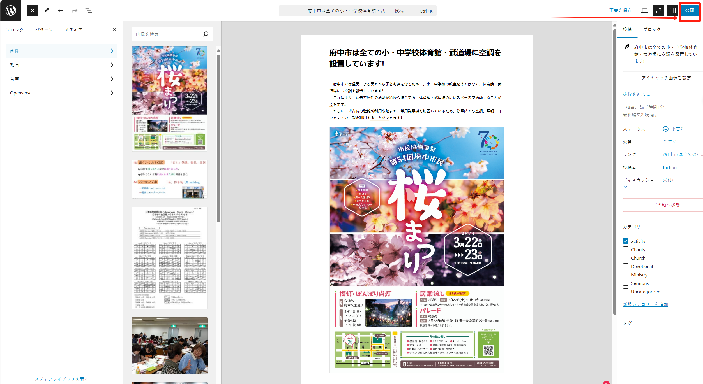
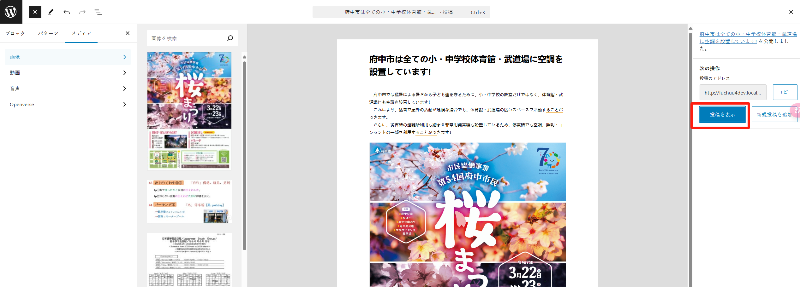
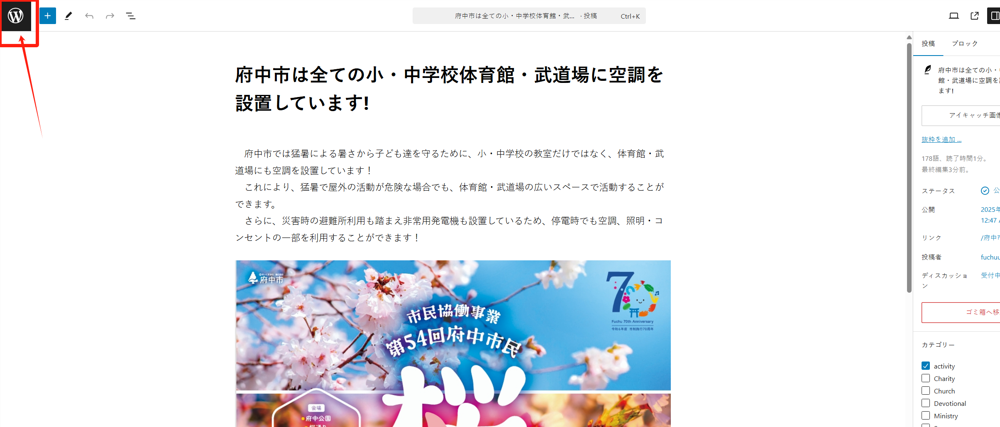

## 创建文章（post，activity）

网站的内容管理主要是指文章，在 wordpress 中指的就是 “post”。体现到网站上的话，就是 “activity” 的页面（实际上 activity 是 post 的其中一个分类）。

创建 activity 的主要步骤如下：

step 1：进入后台管理页面，点击“投稿”菜单进入页面：

step 2：点击“新規投稿を追加”按钮开始创建 activity：

step 3：编辑内容，选择 activity 分类，填写标题和详细的内容：

通过点击 “+” 按钮，添加图片等多媒体内容（图片，视频，音频等）：

按需要选择图片或者视频：

当内容编辑完成后，就可以发布，点击“公開”按钮进行发布（会有一个确认步骤，请再次点击“公開”按钮即可）：

发布后，可以通过右侧的“投稿&表示”按钮，进行查看最终的 activity 页面（也就是读者看到的页面）。

如果 acitivity 文章页有需要修改的地方，可以修改完成后，再次发布即可。

最后，点击左上角的 “W” 按钮，可以回到管理页面：

