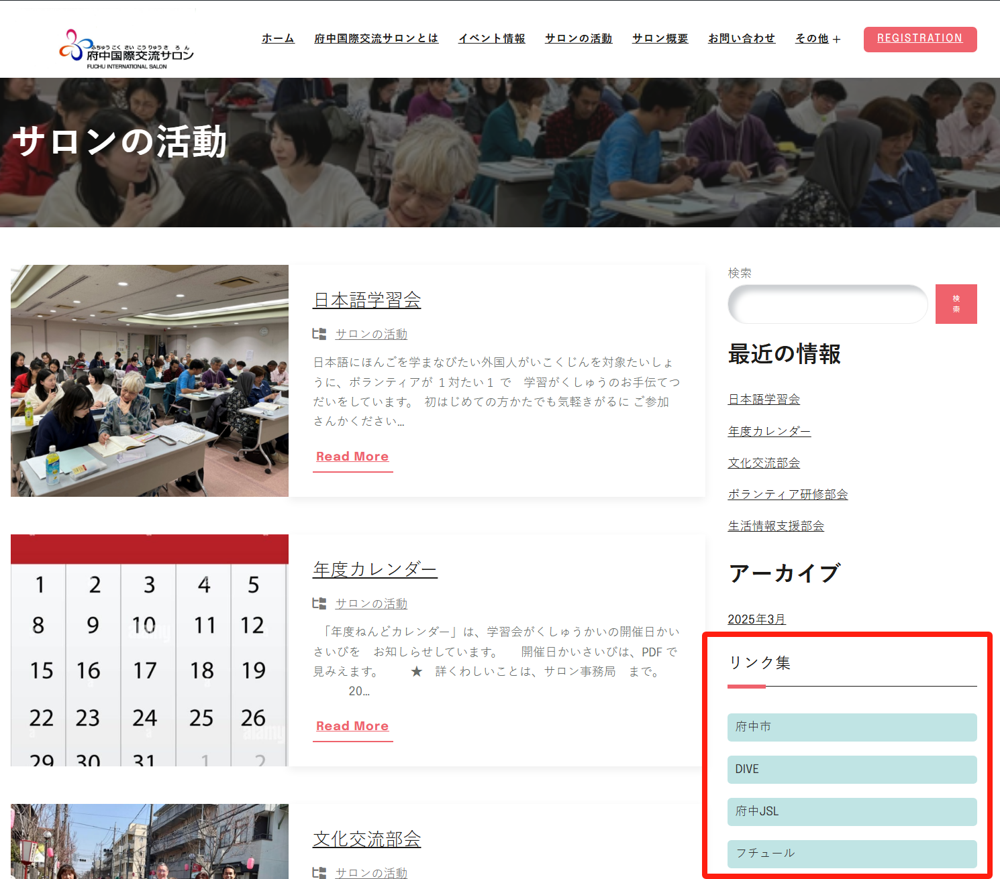
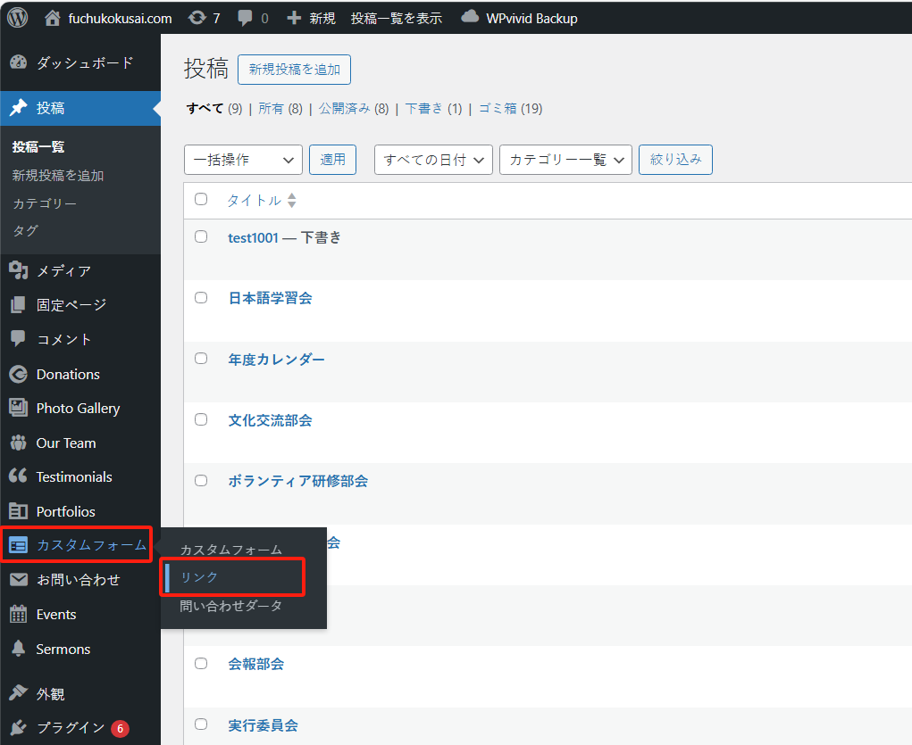
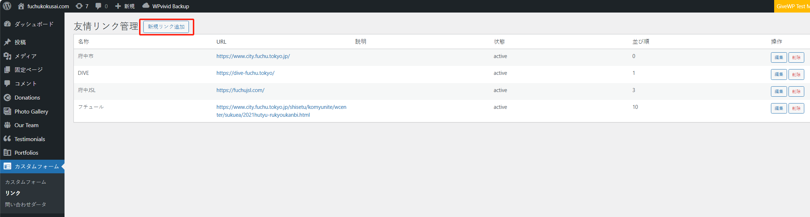
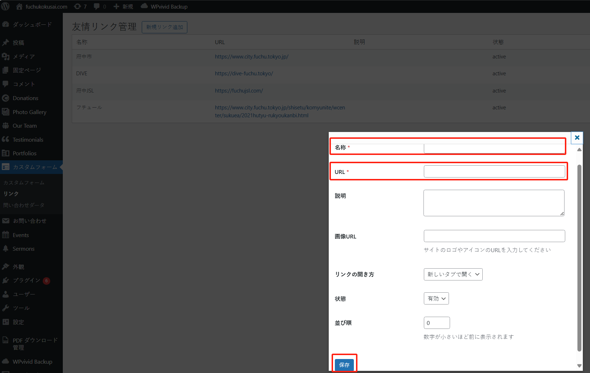
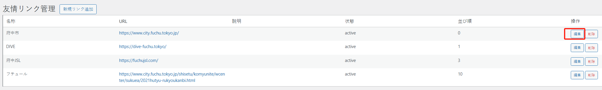
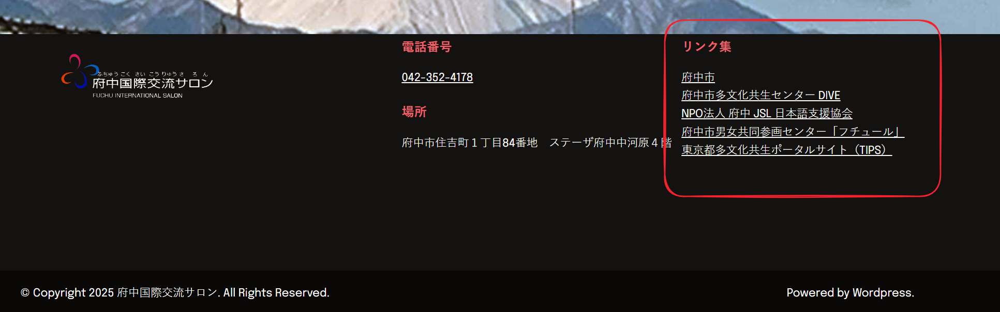
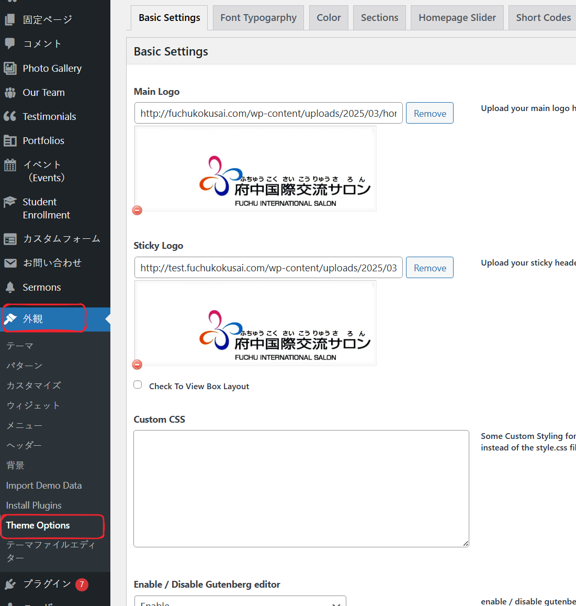
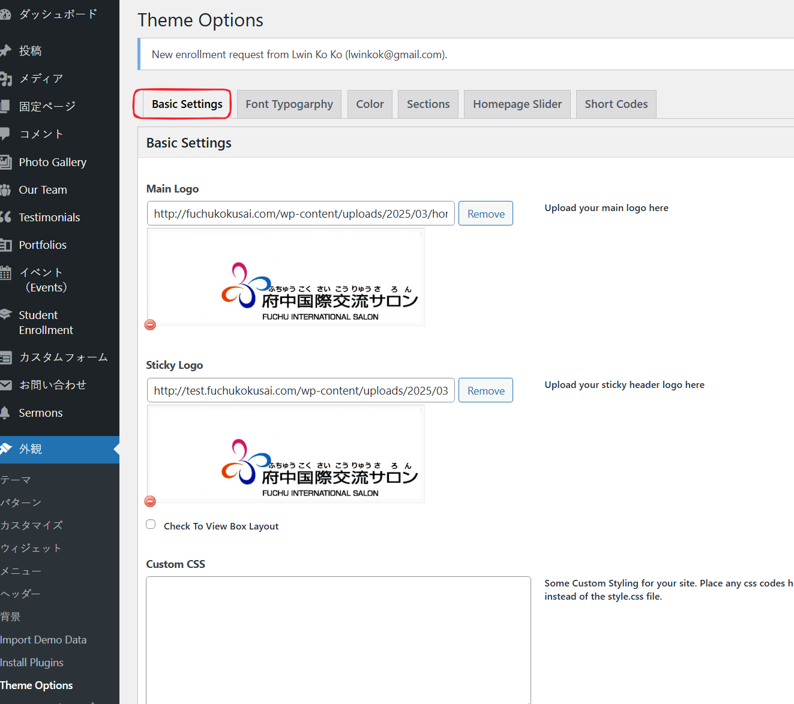
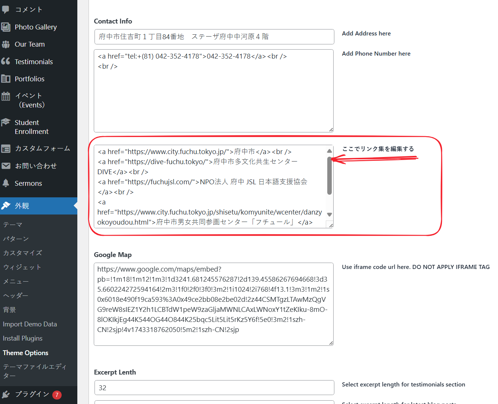
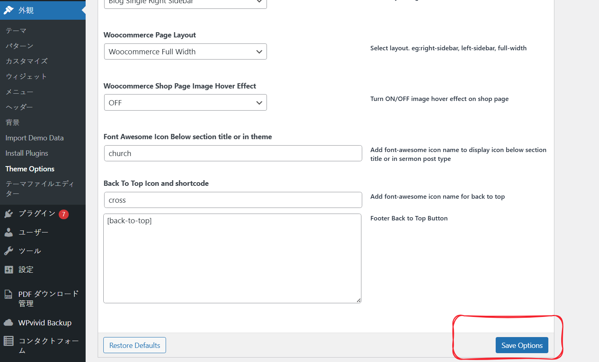

# 友情链接的修改

## 侧边栏的链接

“友情链接”是位于内容展示页面右侧的链接集合，如下区域所示：

如果需要修改，如：新增、修改、顺序调整等，可以进入管理系统的“カスタムフォーム”菜单下的“リンク”子菜单：

### 新增

点击“新規リンク追加”按钮，打开新增的界面：

填写“名称”、“URL”，然后点击“保存”按钮，即可完成。

### 修改

如果想修改链接或者展示的文字，则可以点击相对应的“編集”按钮进行编辑即可。

需要注意的是：友情链接的个数不要太多，最好不要超出 **10** 个。

## 页面底部的链接
在所有页面的底部也展示了一些链接，如图所示：

如果要修改这部分的链接展示，则进入 wordpress 管理后台中，外观 > “Theme Options”：

选择“Basic Settings”标签页：

然后找到如下设置项：

修改完成后，点击页面最下方的“Save Options”按钮进行保存

