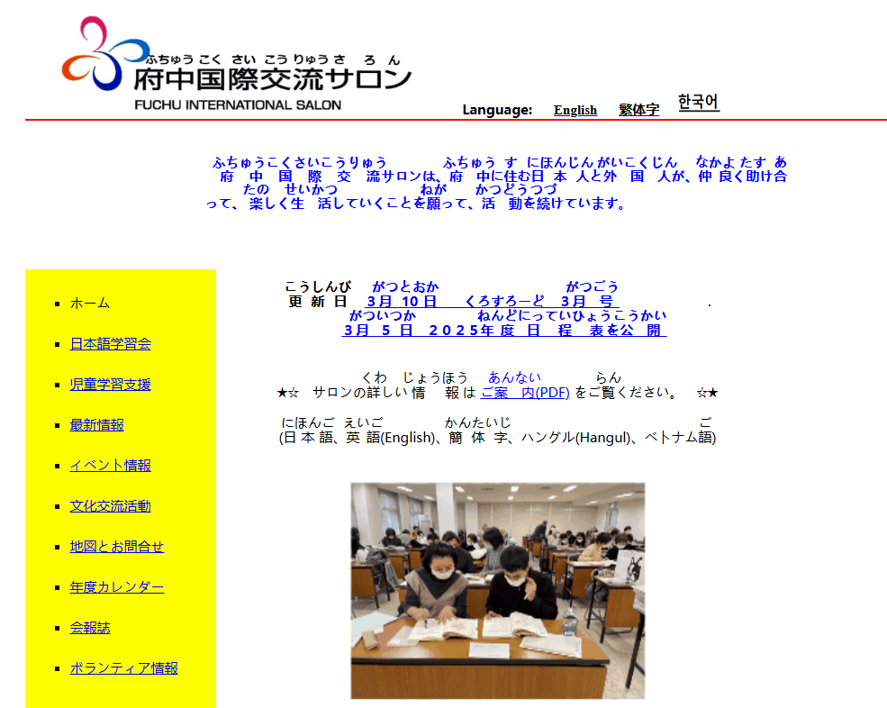
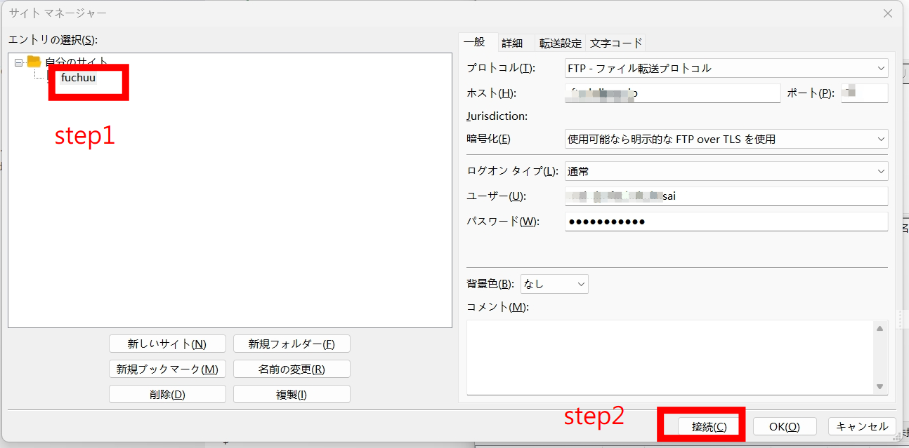
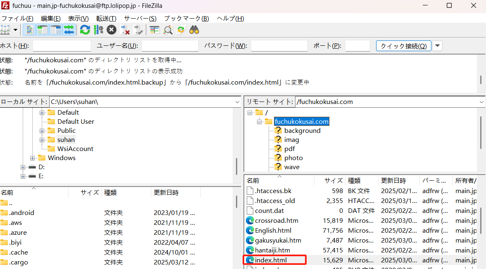
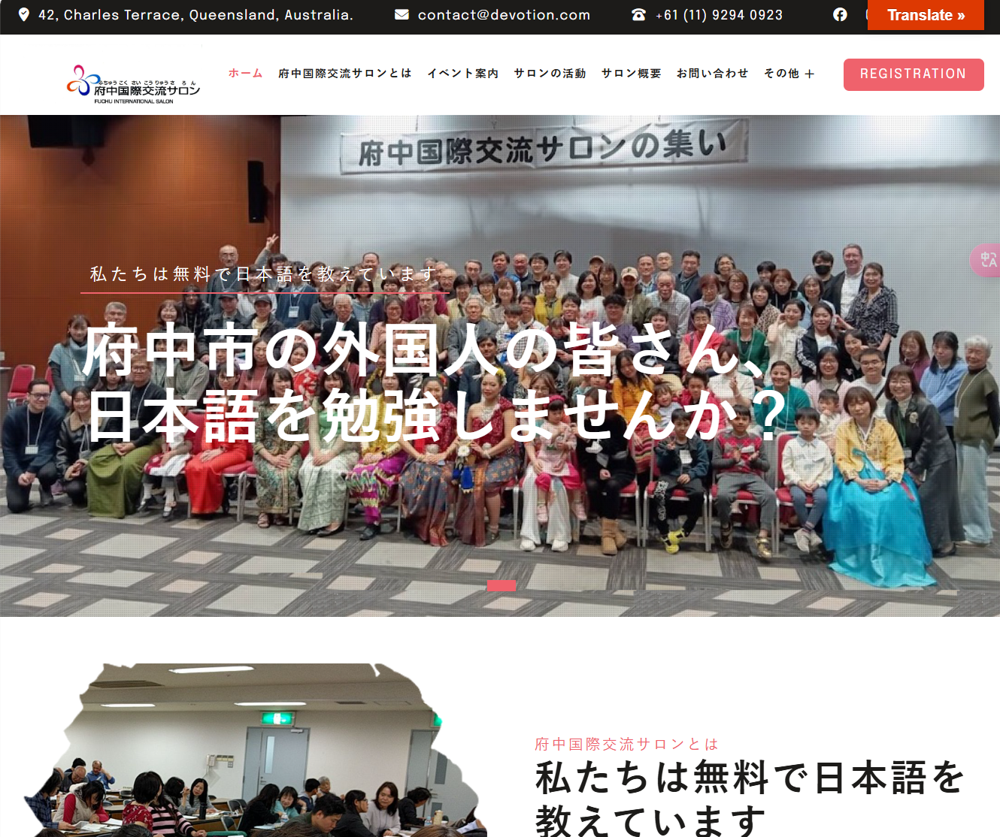

## “府中サロン”主页

采用 [wordpress 6.7](https://wordpress.org/download/releases/6-7/) 进行信息管理和展示。使用的主题是 [Devotion Pro](https://flythemes.net/wordpress-themes/devotion-lite-wordpress-theme/)。

服务器使用的是 https://lolipop.jp/ 提供的 wordpress 服务。

## devotion pro theme 的安装

近期，“府中”沙龙组织决定使用 [Devotion Pro](https://flythemes.net/wordpress-themes/devotion-lite-wordpress-theme/) 的 wordpress 主题，作为主题的安装，需要注意以下几点：

拿到 `devotion-pro.zip` 主题安装包后，直接在 wordpress 后台，主题安装中，选择上传主题，然后选择 `devotion-pro.zip` 安装包，安装即可。

安装完成后，需要导入一些 demo 数据，以便于能快速习惯主题的使用。

主题安装完成后，会提示几个该主题推荐安装的 wordpress 插件，直接选择安装即可。其中之一是 `Devotion Pro Demo Importer` 插件，该插件可以导入 demo 数据，以便于能快速习惯主题的使用。

`Devotion Pro Demo Importer` 插件安装后，在 wordpress 后台，左侧菜单中，选择 外观 -> 导入演示数据，然后选择 2 个文件，分别是 [`devotion.WordPress.2023-12-04.xml`](../files/devotion.WordPress.2023-12-04.xml) 和 [`flydemos.net-devotion-widgets.wie`](../files/flydemos.net-devotion-widgets.wie)，导入即可。

demo 数据导入后，接下来可以配置菜单、首页。

## page setting

### home page

新建一个 page 类型的页面，作为“首页”，然后增加如下内容：

```
[introduction image="http://fuchuu2dev.local/wp-content/themes/devotion-pro/images/about.jpg" image_position="left" sub_title="Joyful Harvest" title="Reaping Joy in God’s Abundance" btn_text="Visit this Sunday" btn_link="#"] Maecenas tincidunt, mi quis rutrum feugiat, felis enim sagittis metus, nec molestie nunc sapien a risus. Mauris a orci cursus, fringilla elit in, laoreet elit. Aliquam fringilla tempor nunc ut auctor. Curabitur nunc nisi, imperdiet sed tincidunt a, luctus at libero.

Vivamus tempus accumsan erat, at sollicitudin justo elementum vitae. Nullam tempor malesuada aliquam. Donec ligula nulla, cursus id posuere sit amet, sodales vel quam. Proin fermentum, sem vitae vestibulum posuere, eros felis pulvinar velit, et maximus sem felis non purus.[/introduction]


[hr]
[section_title sub_title="Latest event" title="Events" section_text="latest event list"]
[events show="3" type="grid" column="3"][button name="See All Events" align="center" link="/myevent1002/"]

[hr]
[latest-news show="3" type="grid" column="3" comment="show" date="show" author="show" category="show"]
```

### event list

新建一个 page 类型的页面，作为 “event” 列表页，然后增加如下内容：

```
[events show="-1" type="grid" column="3"]
```

然后，把 event list 页面的连接，更新到“首页”的连接中。

### 一部の会議議事録エリア

向 home page 页面的指定位置，增加如下内容：

```
[pwd-pdf-list show="6"]
```

### 会議議事録 table

新创建一个 page 类型的页面，然后增加如下内容：

```
[pwd-pdf-table show="10"]
```

### activity page

目前 activity page 是使用文章的一个分类来实现的，所以，需要先创建一个文章分类，然后，编辑文章时，把文章分类设置为该分类即可。

## “府中サロン”主页的服务器文件设置

旧版的主页如下图所示：



通过 filezilla 软件，将 lolipop 购买的 wordpress 服务对应的服务器程序默认入口文件调整为 新的 wordpress 入口文件，即可让 `https://fuchukokusai.com/` 访问的页面为新的 wordpress 页面。

如果没有 filezilla 软件，可以在[官网下载](https://download.filezilla-project.org/client/FileZilla_3.68.1_win64_sponsored2-setup.exe)。安装完成之后，增加 lolipop 对应的 ftp 服务站点。

打开添加好的名称为 `fuchuu` 的 ftp 站点：



（如果没有 ftp 站点账户和密码，可以咨询 “@sueda さん”）

连接后，会加载出名称为 `fuchukokusai.com` 的文件夹，主页的服务器程序文件就存放在其中，入口文件是 `index.html`



`index.html` 它是旧主页的入口文件，如果要切换成使用 wordpress 作为主页时，则将 `index.html` 修改成其他文件名就可以（只要不是 index.html 即可），例如，可以修改成 `index.html.backup`。随后，去浏览器，刷新 `https://fuchukokusai.com/` 页面，可以发现，页面已经切换成新的主页了。如下图所示：



### 恢复旧版主页

如果你想让互联网用户访问的是旧版网页，则只需，将 `index.html.backup` 文件的名称还原为 `index.html` 即可。此时再去浏览器**刷新**网站主页。
