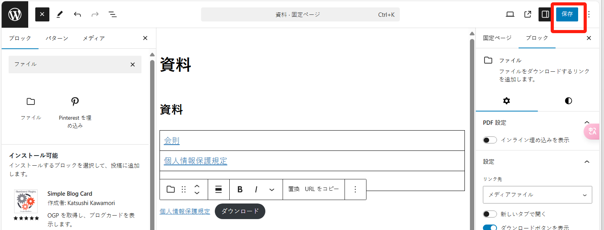

在“资料”页面中，展示了很多关于“府中国際交流サロン”组织的相关资料，用户可以下载。

将新的 pdf 文件追加到“资料”页面中，可以参考以下步骤：

进入“固定ページ”菜单后，搜索到名为“資料”的页面：

然后进入“編集”后，点击页面左上角的“+”按钮：

然后搜索“ファイル”组件，然后选择它：

然后点击“メディアライブラリ”进入媒体库选择合适的 pdf 文件：

如果媒体库文件太多，可以根据文件夹或者日期进行筛选：

选择好文件后，点击右下角的“選択”进行确认：

默认会嵌入文件预览框，如果不需要，可以不开启“インライン埋め込みを表示”选项，此时则只会展示链接：

最后，点击右上方的“保存”按钮：

以上。

