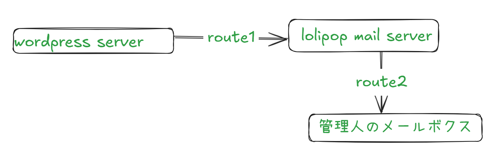
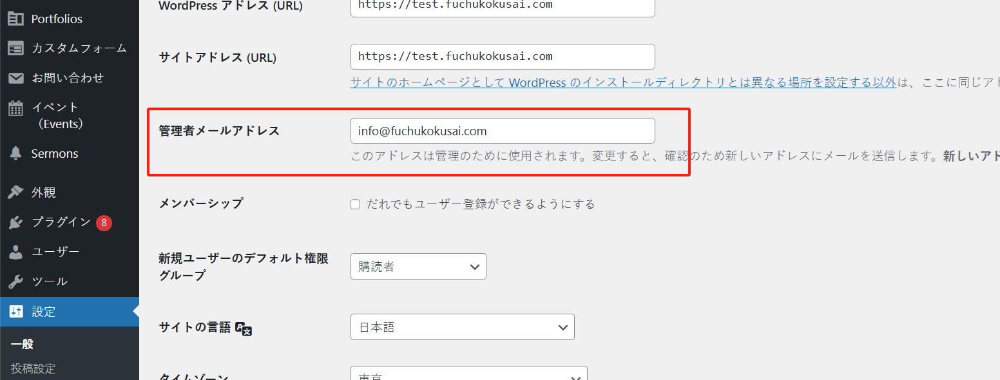
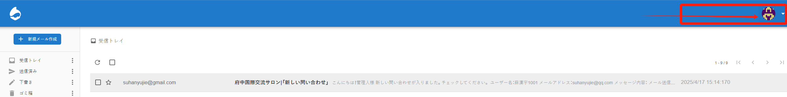
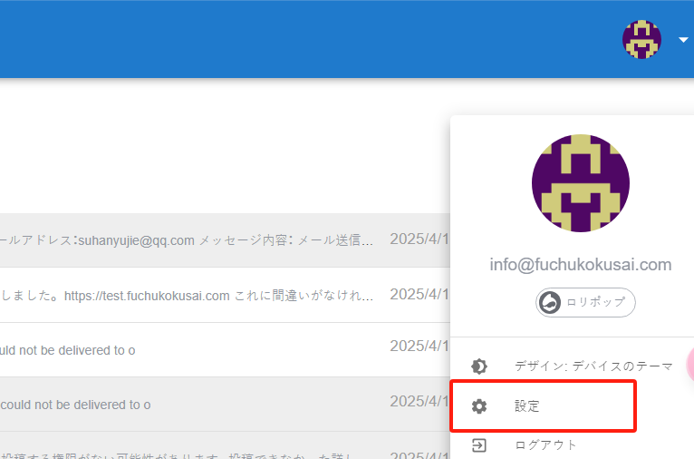
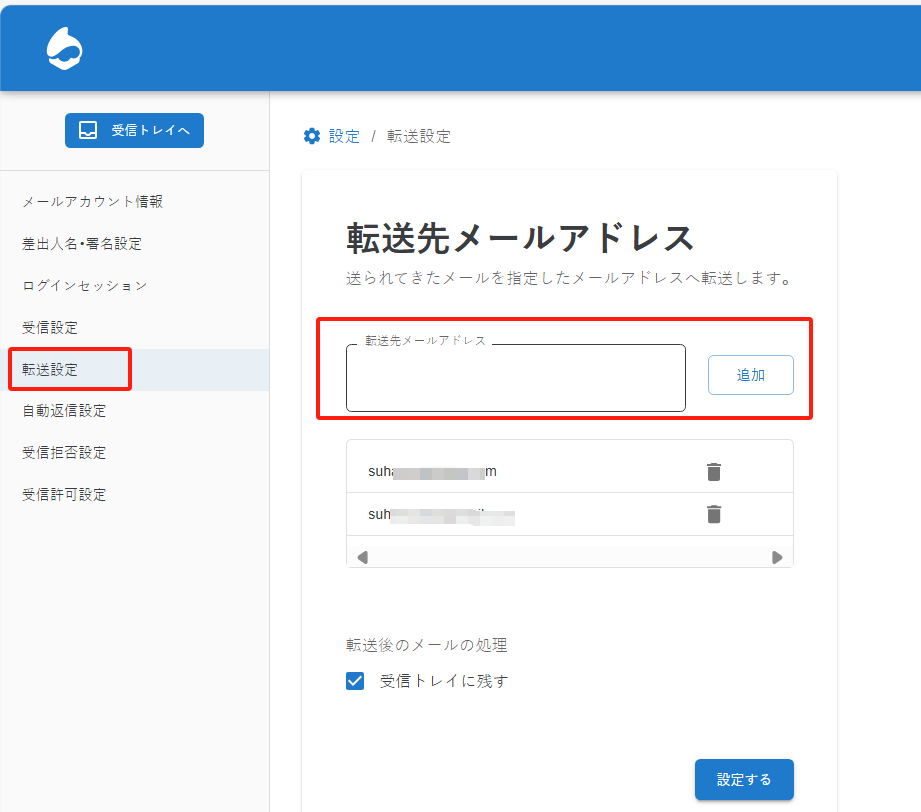

# “問い合わせ”相关的邮件收取

当用户在前台页面中填写了“問い合わせ”，并提交时，后台管理员会收到对应的邮件，并进行回信。

邮件发送的路径是：wordpress server -> lolipop mail server -> 多个管理员的邮箱。

正如图中所标注的，“route1”对应的设置位于菜单中的“設定”菜单中：

用户填写了“問い合わせ”后，会向该邮箱中发送通知邮件。图中填写的是 lolipop 提供给我们的邮箱，可以在 https://webmail.lolipop.jp/ 进行登录。

lolipop 邮箱具备邮件转发功能，我们可以将受到的邮件，转发到多个管理员邮箱中。这就是 route2 对应的过程。转发的目标邮箱可以登录后进行设置。

登录 lolipop 邮箱后，点击右上角的设置按钮：

参考截图，可以自由地追加新的管理员邮箱。
