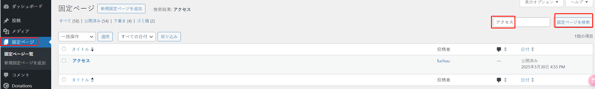
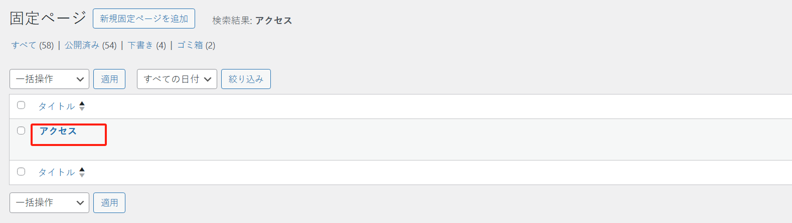
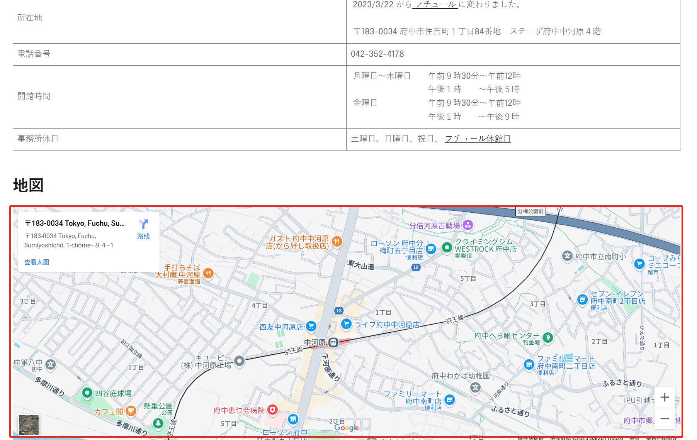
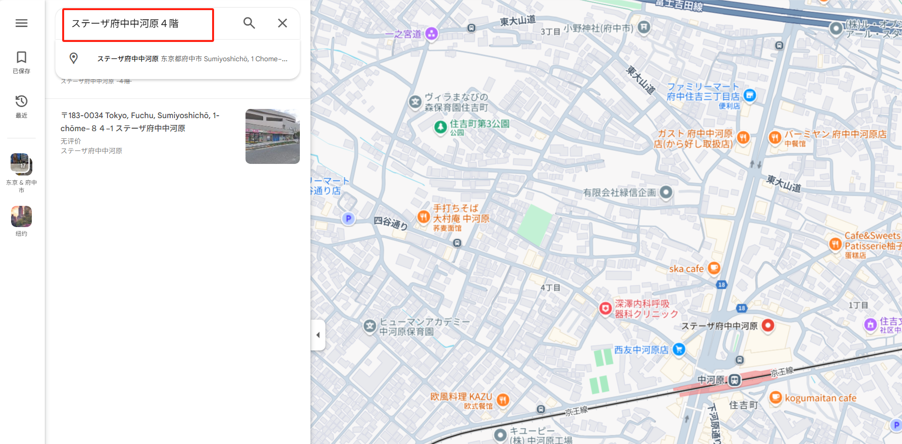
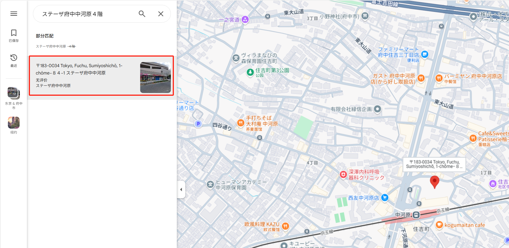
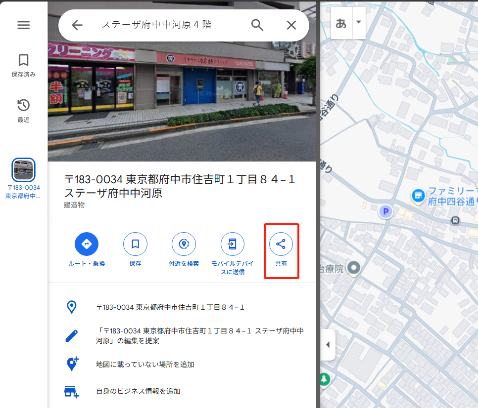
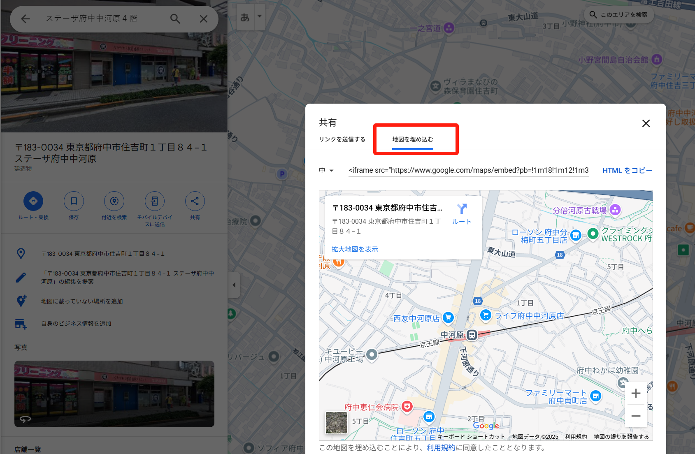
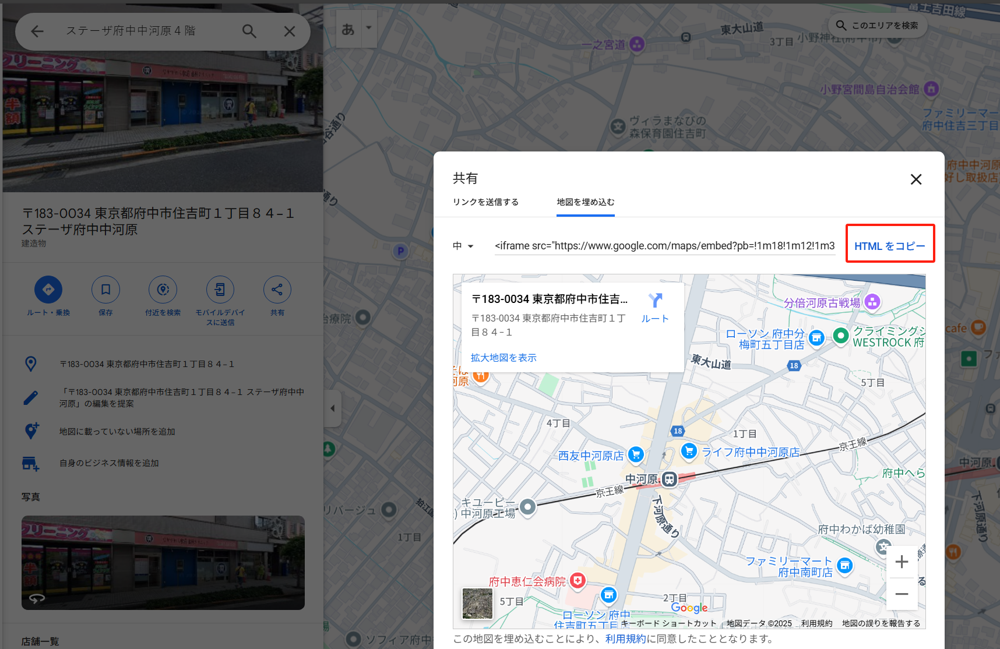
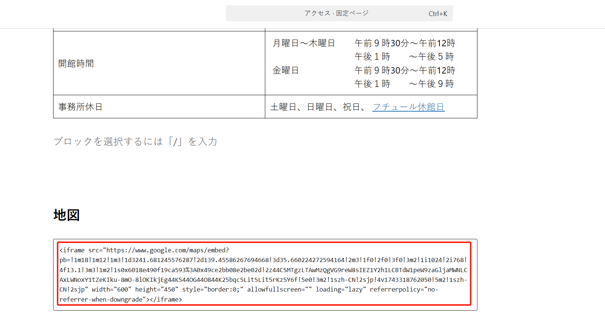
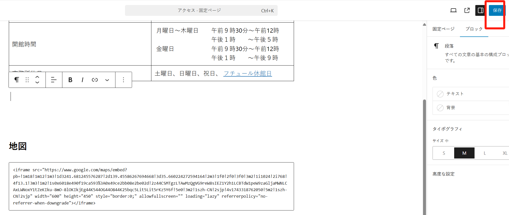

## “アクセス”

这个页面位于“固定ページ”菜单下：

如果“page”太多，可以通过关键字搜索“アクセス”相关的“page”：

点击标题进入编辑页面：

### 地图的修改

如果要修改地图，可以参考以下方式：

1.进入 [google map 网站](https://www.google.com/maps)

2.搜索新的地址进行搜索，例如：`ステーザ府中中河原４階`

2.1 点击搜索到的地址：

3.点击“共有”按钮

3.1 选择“地図を埋め込む” tab 项：

3.2 点击“HTML をコピー”按钮：

4.回到页面编辑页面，将复制的内容粘贴到指定区域内：

5.点击“保存”按钮即可完成

