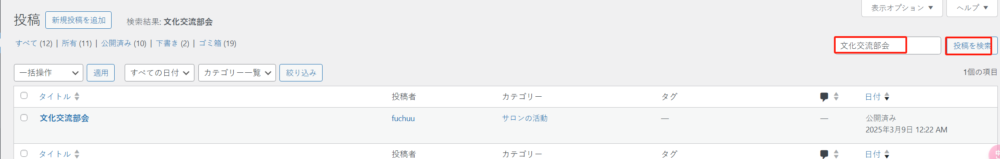
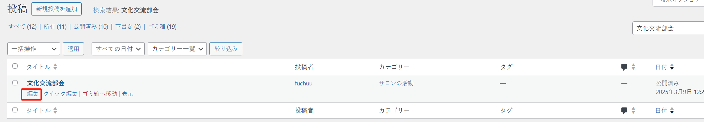
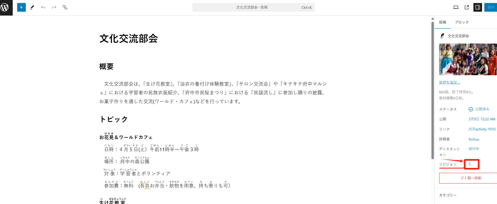
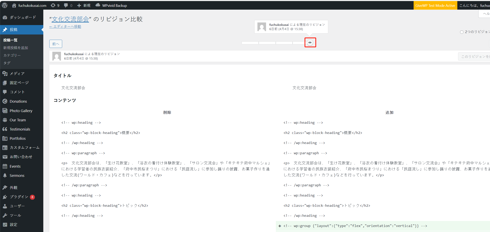
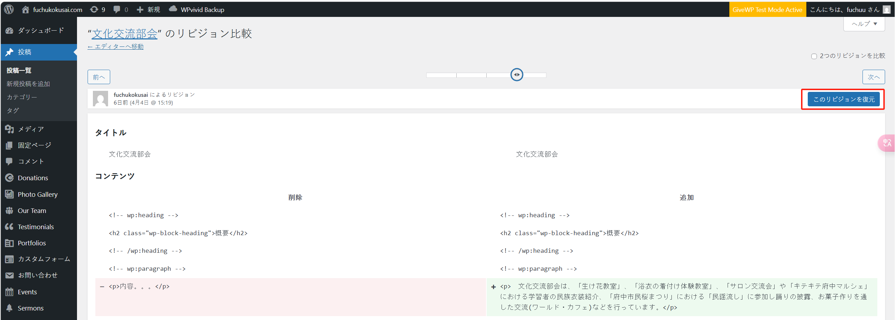
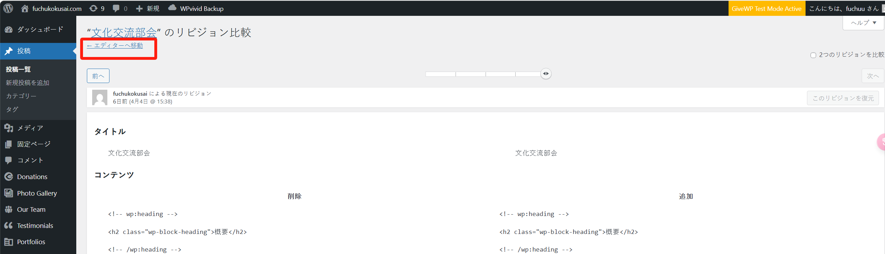
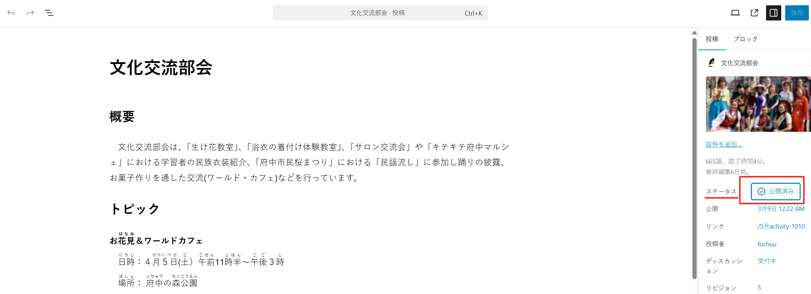
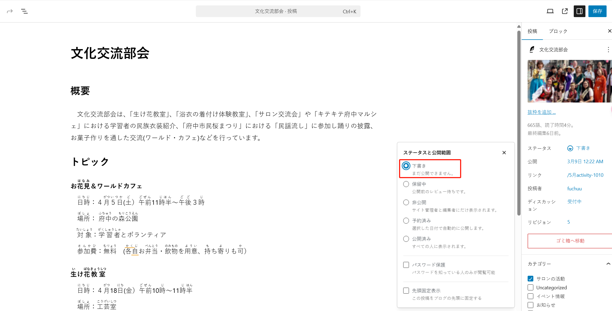

## “文化交流部会”

这个页面位于“投稿”菜单下：

如果文章太多，可以通过关键字搜索“文化交流部会”相关的文章：

此时，可以对文章内容进行编辑：

### 查看内容修改历史

如果不小心修改了文章内容，或者想恢复到历史的某个版本，可以点击右侧的“リビジョン”的历史记录：

通过滑动按钮，可以自由地查看修改历史，从而方便地恢复到历史版本：

确定好后，点击“”按钮进行确认：

如果不想做任何修改，也可以点击“エディターへ移動”链接，回到编辑器：

### 撤销发布

如果内容还没准备好，可以暂时不发布。点击右侧的“ステータス”进行切换：

可以切换成“下書き”，点击“保存”后，用户就看不到当前这个文章了。

