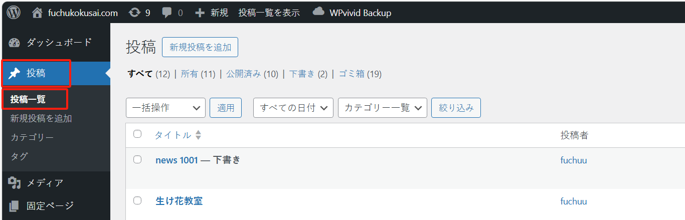

## “日本語学習会”

这个页面位于“投稿”菜单下：

如果文章太多，可以通过关键字搜索“日本語学習会”相关的文章：

此时，可以对文章内容进行编辑：

### 文章的分类

编辑文章时，可以勾选右侧的“カテゴリ”来对文章进行分类。一个文章可以归类到多个分类下：

### アイキャッチ画像

编辑文章时，点击右侧边的“アイキャッチ画像を設定”按钮，可以给文章添加封面图片，这样在文章列表中会比较美观

设置封面图片后，列表中会显得美观：

