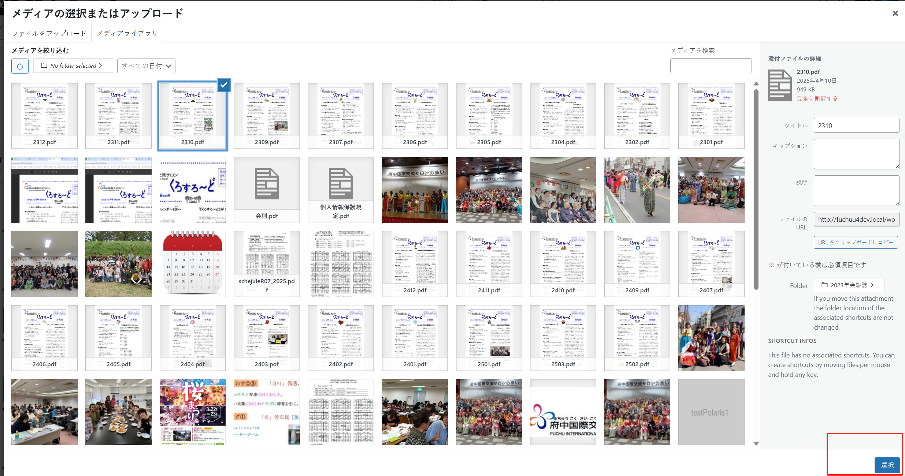

## “生活情報支援部会”

这个页面位于“投稿”菜单下：

如果文章列表太多，可以通过关键字搜索“生活情報支援部会”相关的文章：

点击标题可以进入编辑页面：

### 页面中导入 pdf 文件链接

有 2 中方式：

#### 方式 1
通过添加媒体库中的文件。点击左上角“+”按钮

找到“ファイル”组件：

点击“メディアライブラリ”按钮，然后从其中选择你需要的文件

确定好文件后，点击“選択”按钮进行确认：

点击右侧的工具栏开关，取消 pdf 嵌入，而是只展示下载链接：

如果不希望显示“ダウンロード”按钮，则点击按钮取消：

此时只会展示 pdf 文件的下载链接：

此外您也可以修改链接的显示名称，例如改为 `2310.pdf`:

最后点击“保存”按钮。

#### 方式 2
你也可以通过去“メディアライブラリ”中寻找文件，然后复制文件的 URL，然后将其设置为文字的链接。

选中特定的文字，然后点击按钮，如下所示：

将 URL 粘贴进去，然后按下回车按键即可。

最后点击“保存”按钮。

