## “サロン概要”

这个页面位于“固定ページ”菜单下：

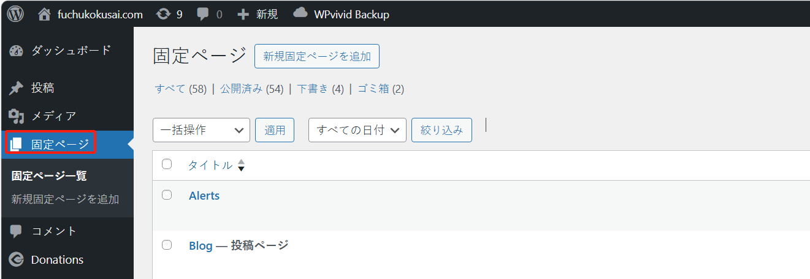

如果“page”太多，可以通过关键字搜索“サロン概要”相关的“page”：

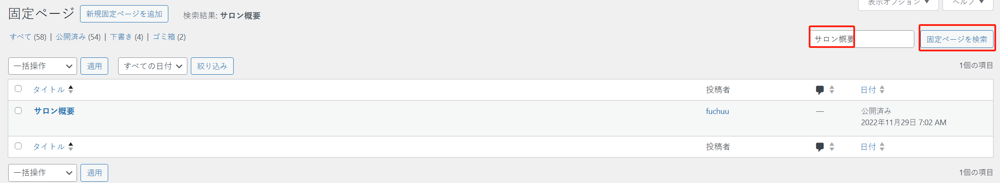

此时可以对页面进行编辑：

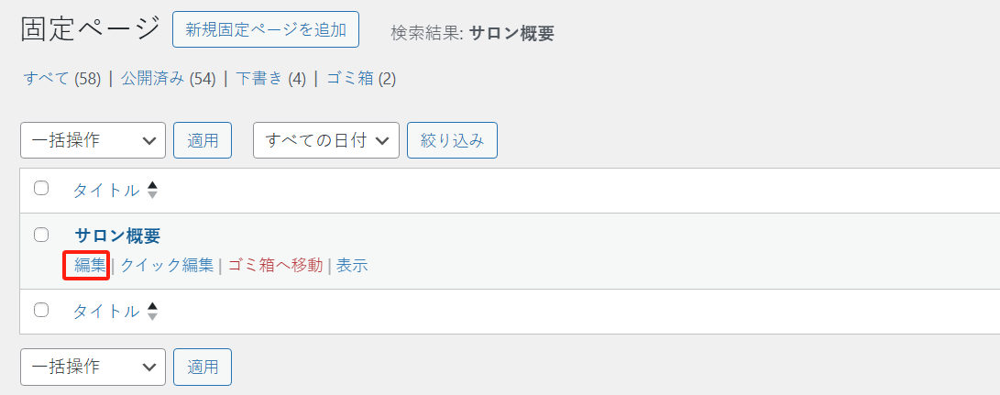

页面中有几个特殊的地方，需要注意：

### 会长问候

这个区域是根据“shortcode”生成的，因此如果代码不正确，会导致页面无法正常显示，因此修改内容时，需要特别小心，修改完成后，需要确认效果，一旦页面遭到破坏，请对页面的编辑进行撤回（可以回到历史版本）。

“会長挨拶”的内容区域，所对应的代码如图所示：

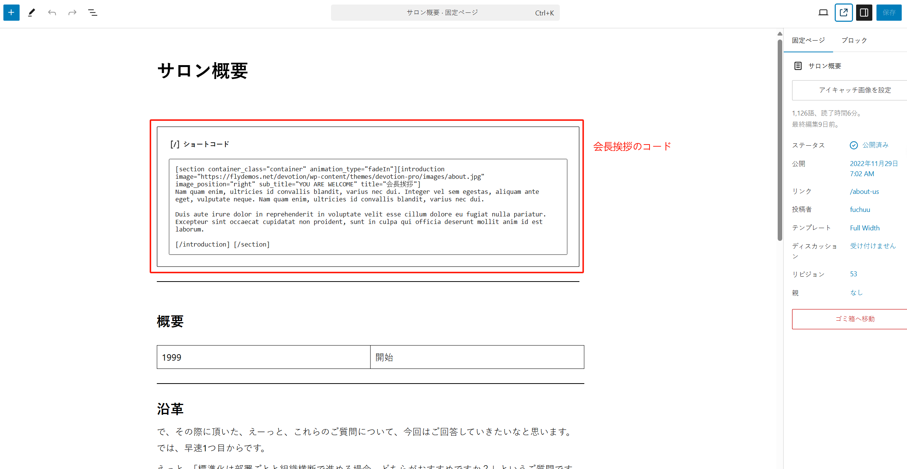

内容对应的位置如图所属，根据位置指向，从而对内容进行修改：

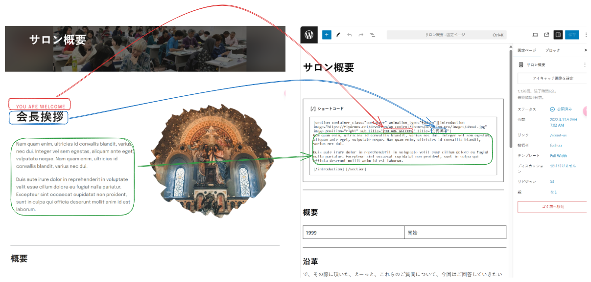

#### 图片修改

该区域中的图片修改方式如下：

1.先从媒体库中找到目标图片，复制图片的 URL 地址：

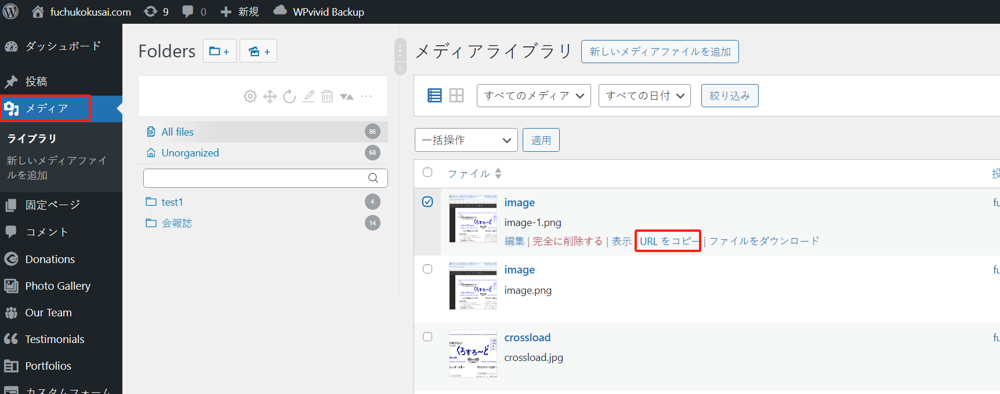

2.将图片 URL 粘贴在如下位置（注意：需要保留内容两边的双引号 `"`）：

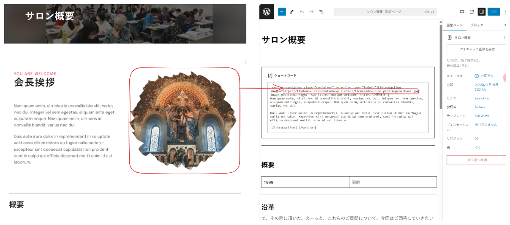

（注意：需要保留内容两边的双引号 `"`）修改完后，请检查：

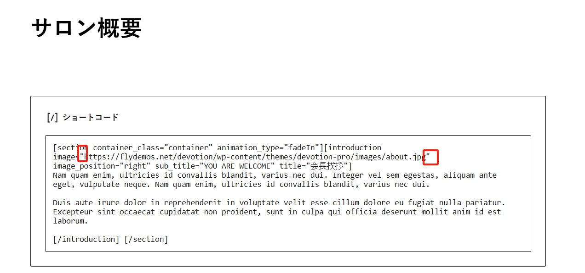

### 会報誌

如果有新的“会報誌”制作出来，需要放到页面的链接上时，可以参考以下步骤：

1.先将 pdf 文件上传到“メディアライブラリ”中：

1.1 进入文件编辑模式中：

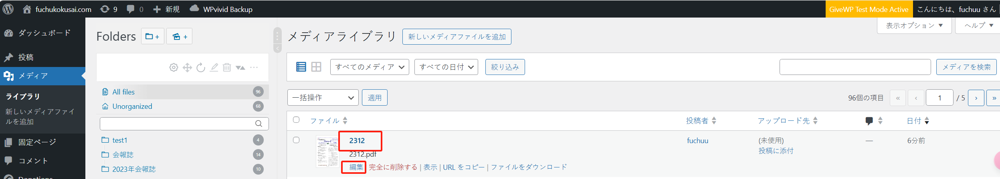

1.2 复制文件的 URL：

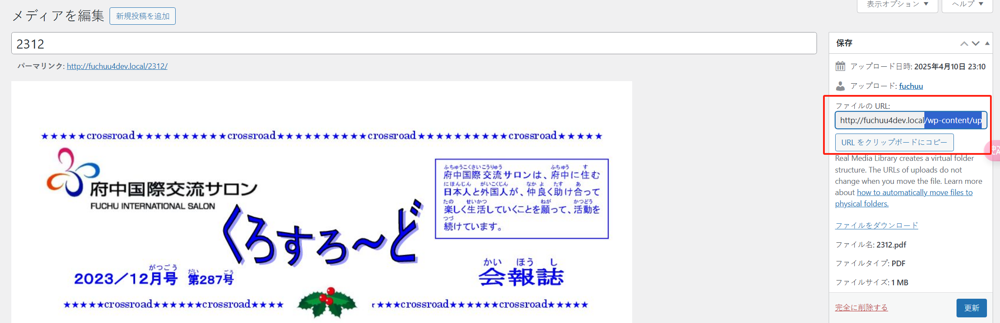

1.2.1 （可选）其实最好的方式是，复制的 URL 中不包含域名部分：

例如，您复制的 URL 是：`http://fuchuu4dev.local/wp-content/uploads/2025/04/2312.pdf`

（域名部分是 `http://fuchuu4dev.local`）那么您只需复制这部分：`/wp-content/uploads/2025/04/2312.pdf`

这样做的好处是，防止将来更换网站域名导致文件无法访问的问题。（如果这个操作对您来说很难，那么就直接复制全部的 URL 吧。）

2. 用鼠标选中文字，给文字增加链接：

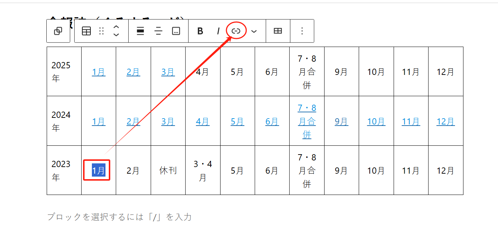

2.1 然后将步骤 1 中复制的图片 URL 粘贴在如下位置（随后按下回车键确认即可）：

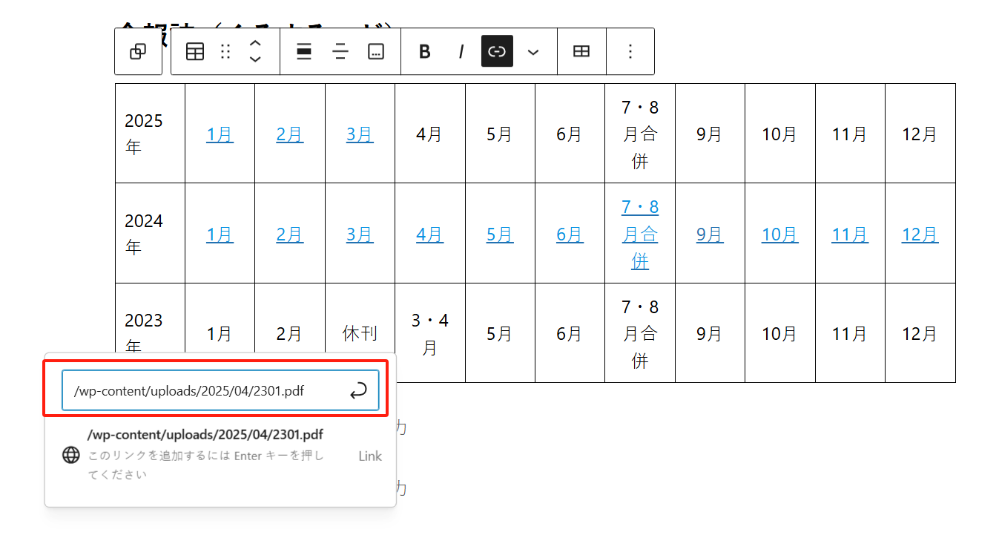

此时，链接添加完成。最后点击右上角的“保存”按钮，保存页面内容。

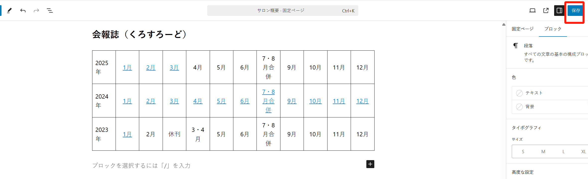
