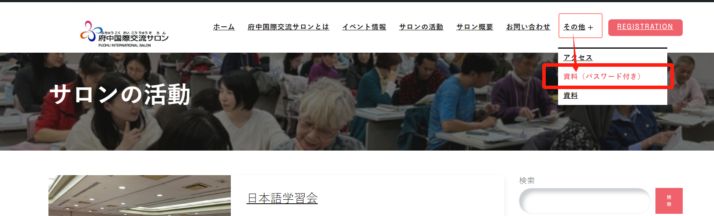
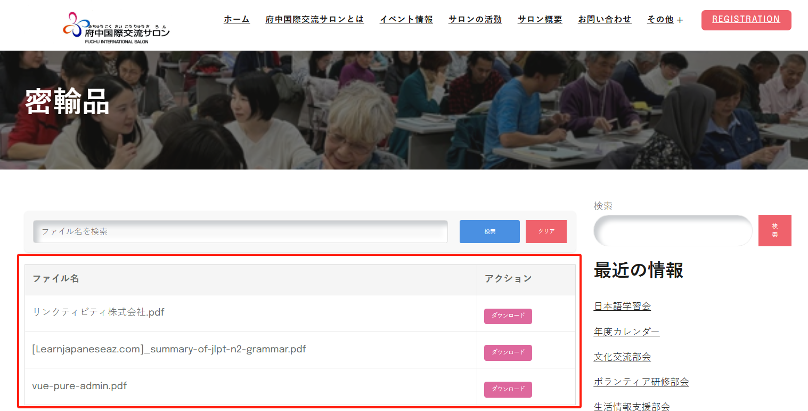
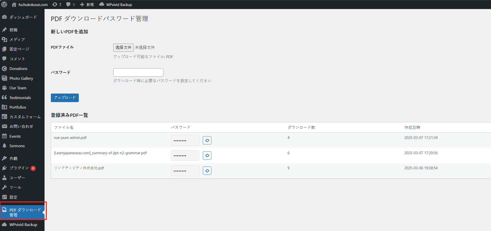
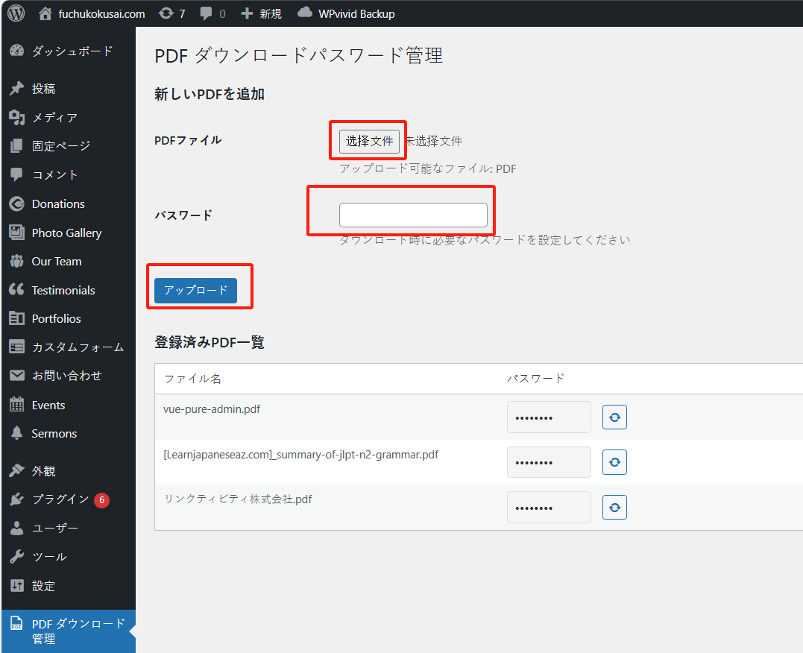
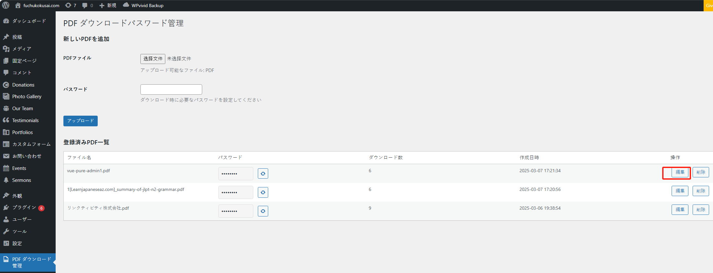
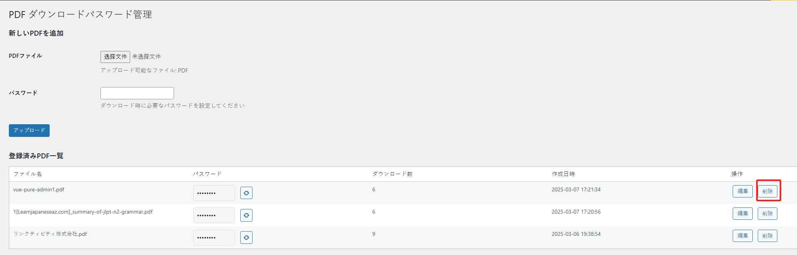

带有密码的 pdf 文件列表页面可以从菜单中的“その他”>“資料（パスワード付き）”访问页面。

如果需要增加更多的 pdf 文件或者删除文件，可以参考以下步骤。

## 新增

进入管理系统中，点击“PDF ダウンロード管理”菜单：

选择要上传的 pdf 文件后，填写密码，然后点击“アップロード”按钮，即可完成新增。

## 修改

确定要修改的 pdf 文件，然后点击“編集”按钮进行编辑，这样可以编辑文件的名称和密码。

## 删除

确定要修改的 pdf 文件，然后点击“削除”按钮，即可删除 pdf 文件。

