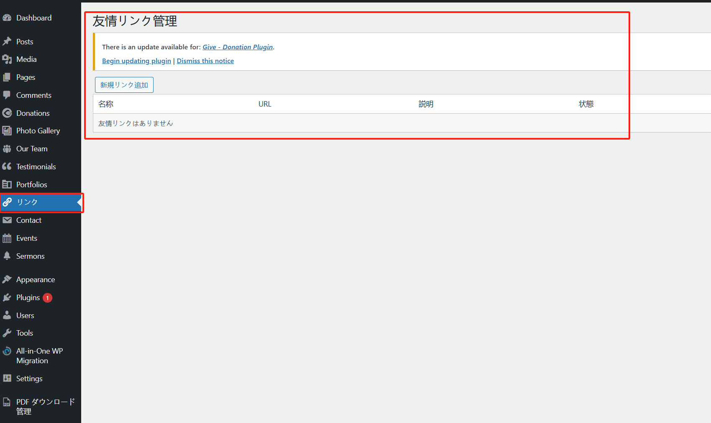
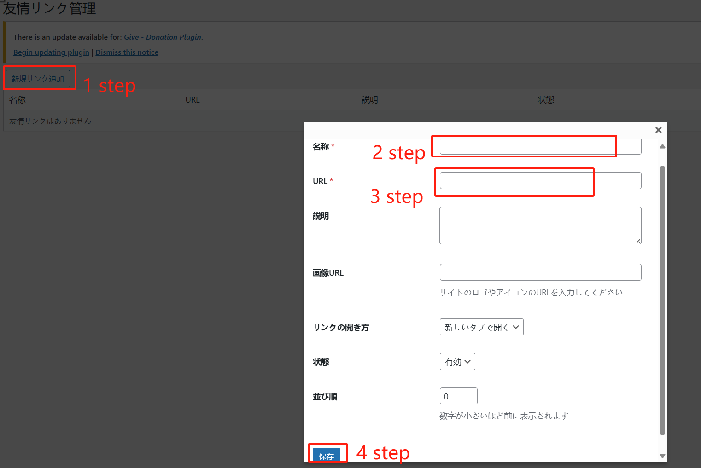

## 插件的安装

从[代码发布地址](https://github.com/suhanyujie/wp-link-gallery/releases)下载插件的压缩包（zip 文件），然后上传到 WordPress 后台的插件安装页面，然后点击激活即可。

## 插件的使用

插件安装并且激活完成后，在 wordpress 后台管理界面中，可以在左侧菜单中看到“リンク”的菜单项目。

### 新增“链接”

点解“新規リンク追加”按钮，添加新的友情链接：

此时，在文章页面的右侧边栏，下方可以看到新增的友情链接：

