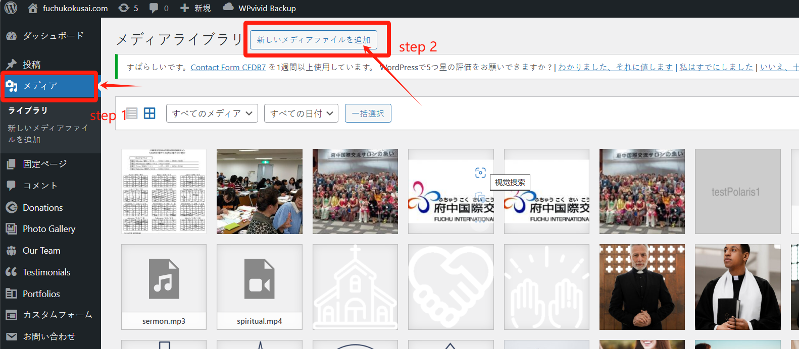
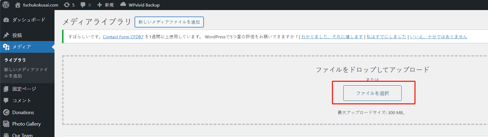
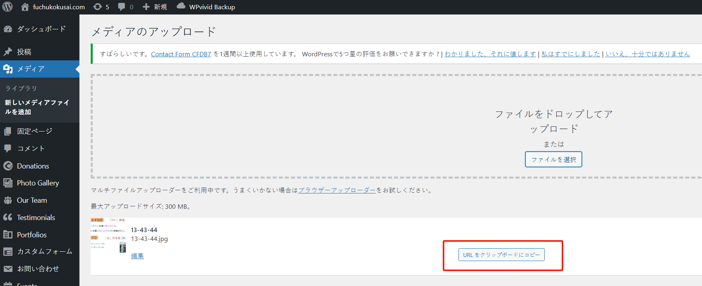
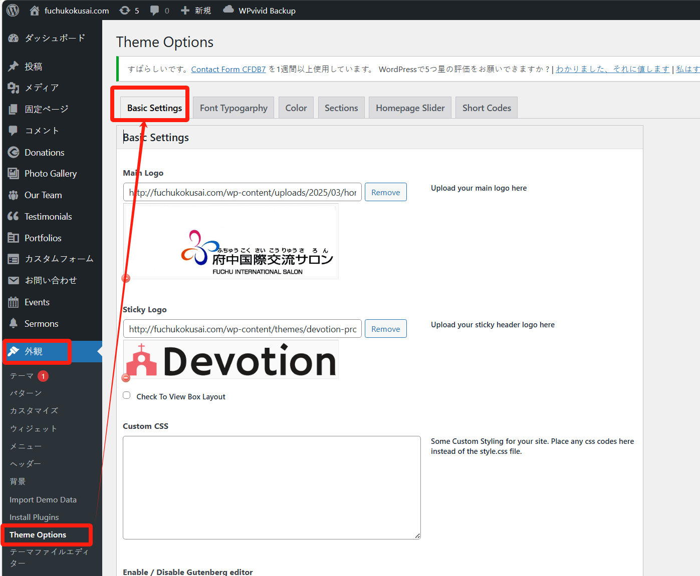
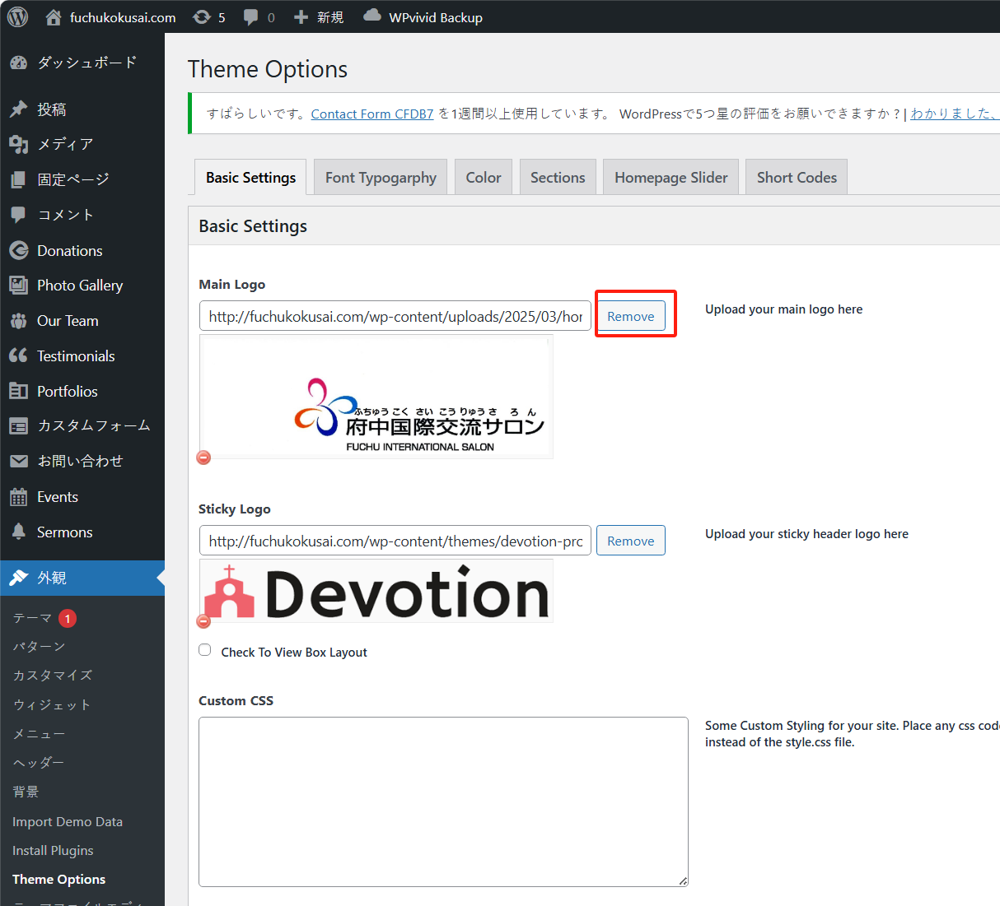
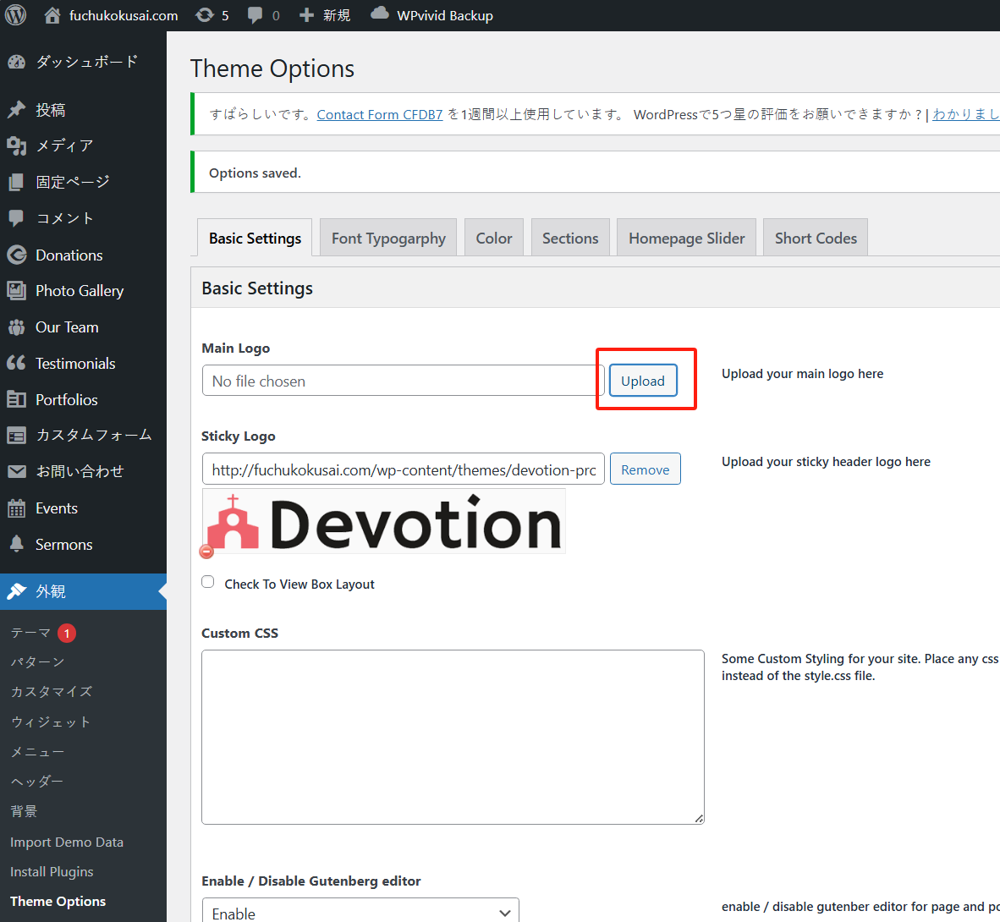
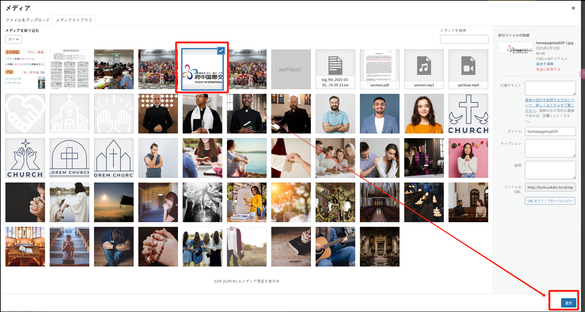
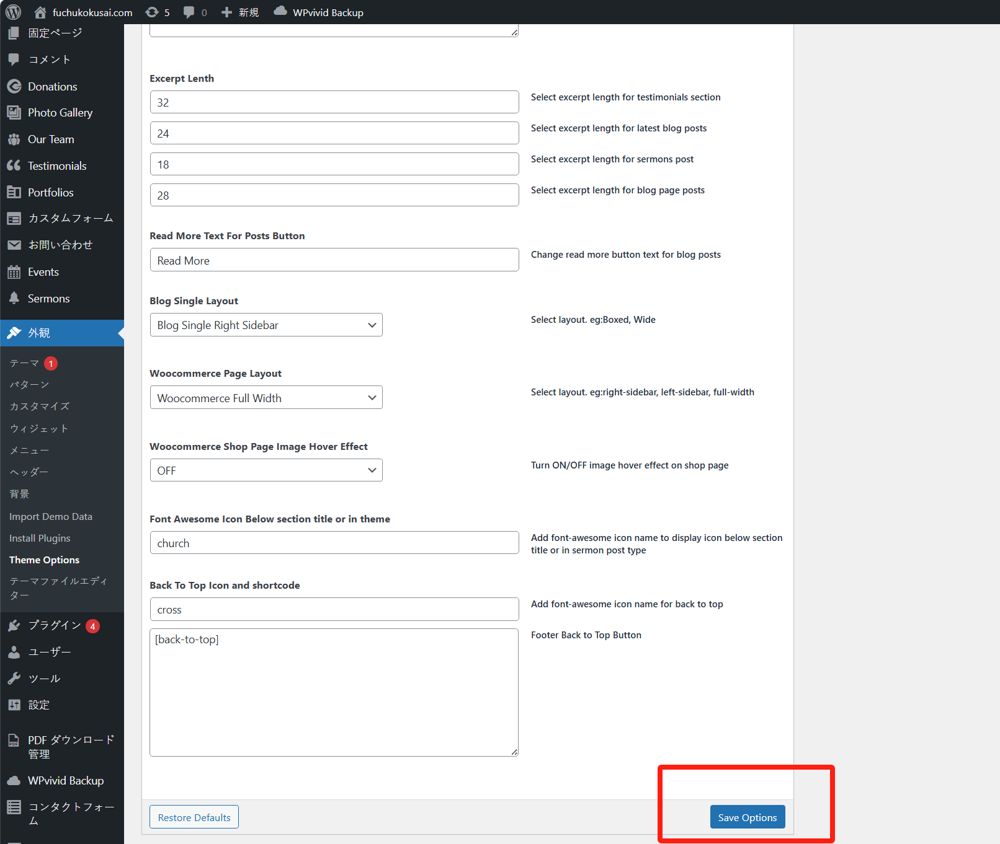

# 使用指南 1

## 更换网站的 logo

网站的 logo 显示在页面的如下位置：

如果您要更换一个新的 logo，可以按照下面的步骤进行更换。

step 1. 准备好你的新的 logo 图片，进入主页的后台管理系统，进入“メディア”菜单中，点击“新しいメディアファイルを追加”按钮：

然后点击按钮“ファイルを選択”，上传新的 logo 文件：

等待上传完成后，可以点击按钮“URL をクリップボードにコピー”复制图片 URL：

step 2. 进入主页的后台管理系统中，进入菜单 “外观” > “Theme Options”，点击 “Basic Settings” 按钮：

点击 “Remove” 按钮，删除旧的 logo：

删除后，按钮变成 “Upload”，此时点击 “Upload” 按钮：

然后找到您刚刚上传的 logo 图片，选中后，点击“選択”按钮：

**最后**，进入页面最下方，点击 “Save Options” 按钮，即可完成。

