## 网站主页的修改

目前的首页是基于 devotion theme 的 shortcode 定制而成，如果想了解该过程，可以直接查看[官方文档](https://flydemos.net/docs/devotion-doc/)。主页的 shortcode 代码页面位于“固定ページ” > “mySamplePage1001” 页面中。

对于现有的主页，如果只是简单的修改文字和图片的内容，可以参考以下步骤：

### 修改首页的菜单

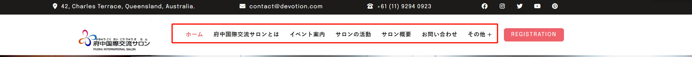

如果想对菜单进行文案修改、链接、顺序，新增链接等操作时，可以进入编辑页面，如下所示：

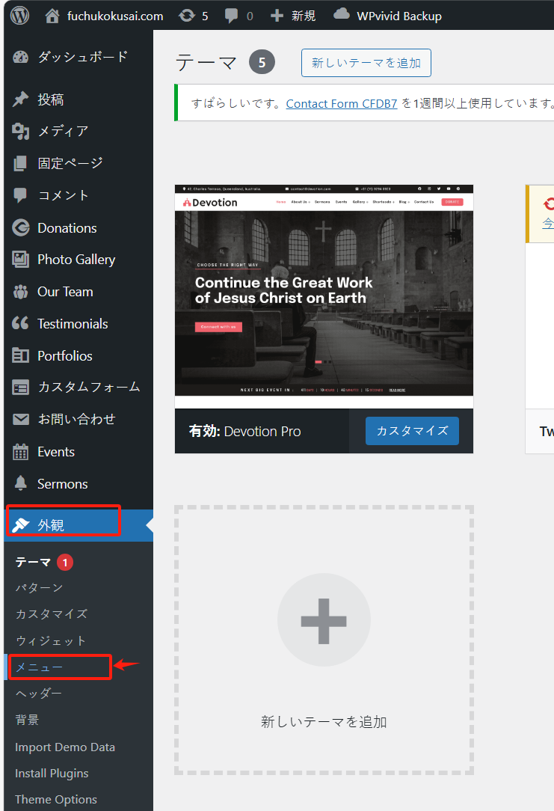

确保选择的是带有“Primary Menu”标记的菜单（有该标记代表是 home page 的菜单）：

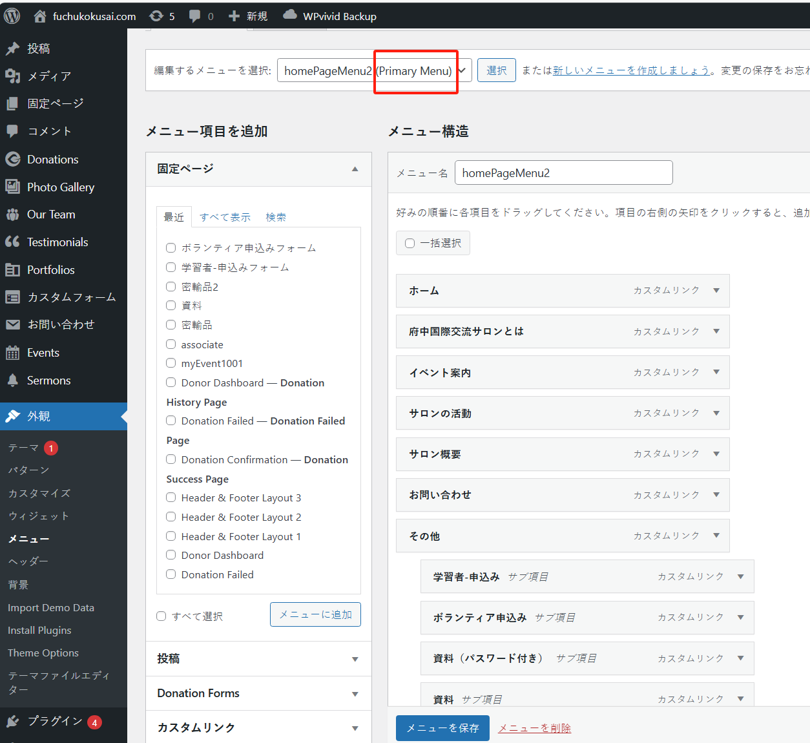

此时可以看到，待修改的菜单就在下方：

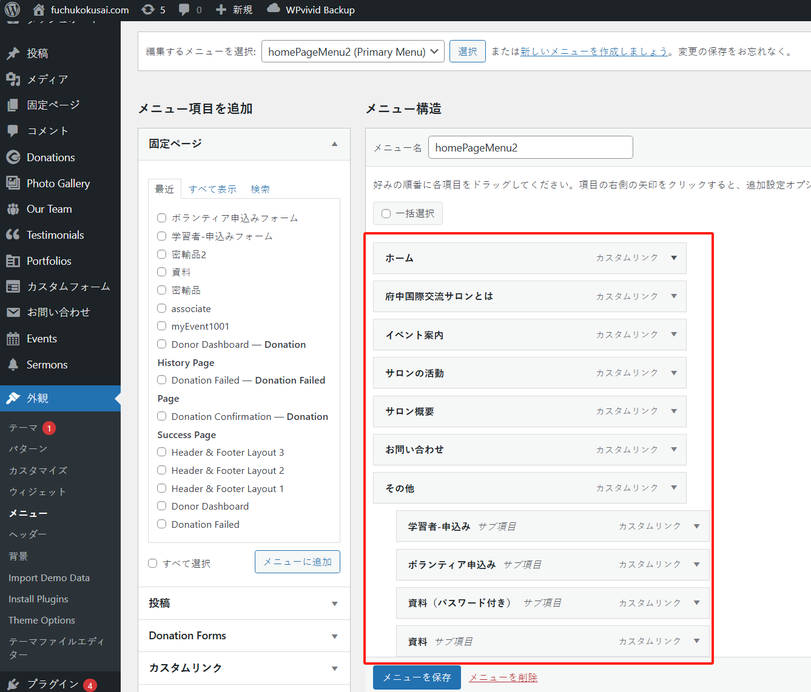

如果只是想修改它们的顺序，可以直接把 menu item 用鼠标进行拖拽，这样更加方便。

如果是修改链接或文字，这点击右侧的箭头按钮：

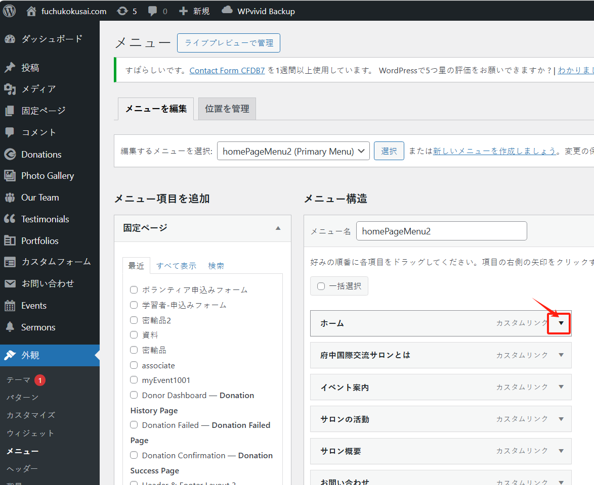

修改完成后，点击下方的“メニューを保存”按钮即可。

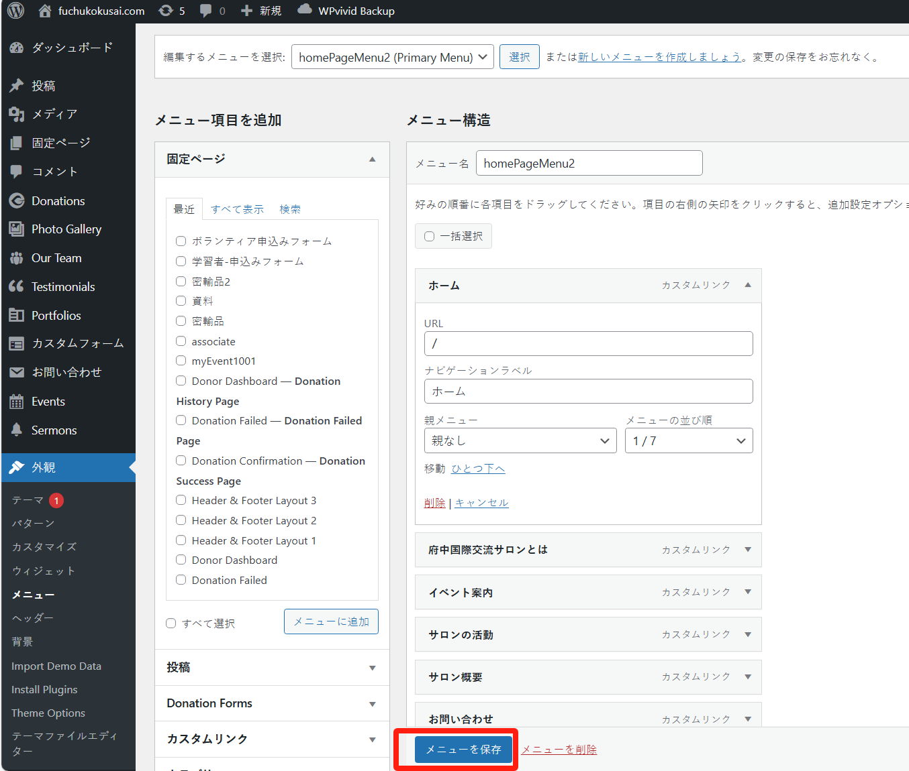

### 修改首页大图（slide）（又称幻灯片图片）

首页中可以展示多个大图并对其添加文字或链接：

如果要对其进行修改，可进入后台的管理页面：“外観” > “Theme Options”：

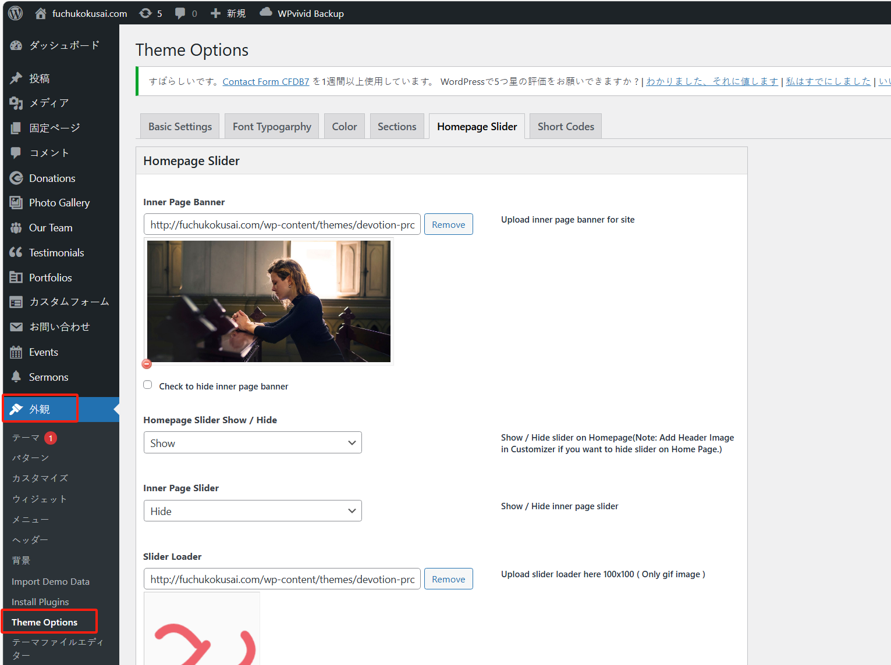

进入 “Homepage Slider” 页面中：

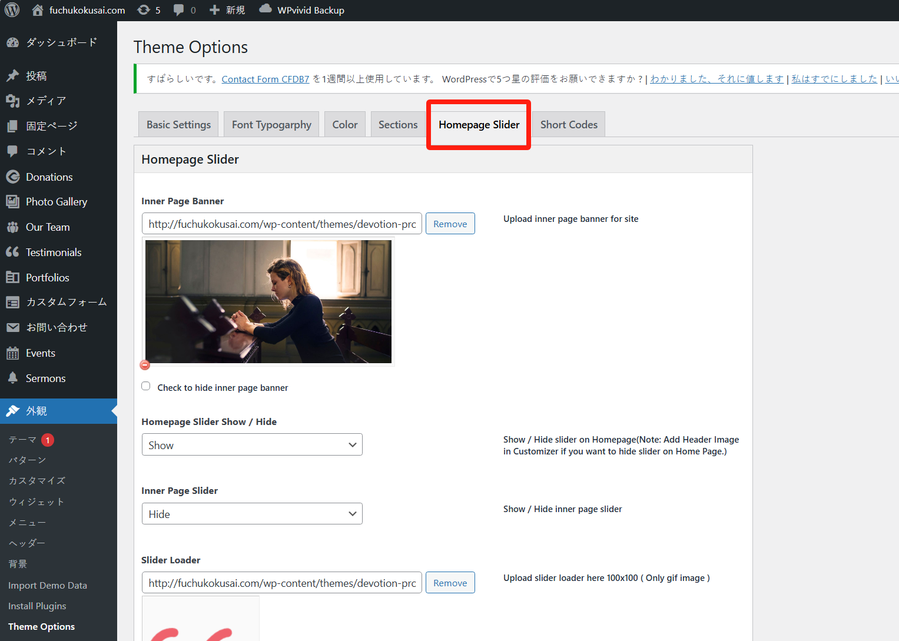

找到 “Slider Image” 设置区域：

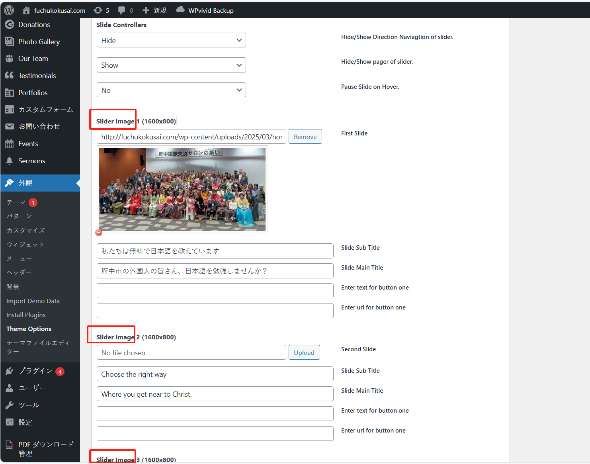

不需要的大图可以点击 "Remove" 按钮进行删除：

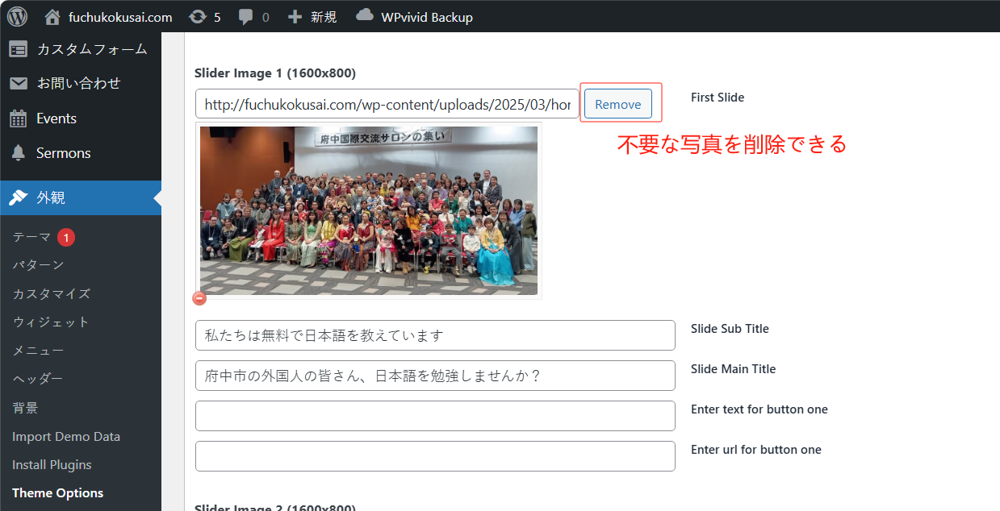

如果要使用新的图片，可以点击 “Upload” 按钮：

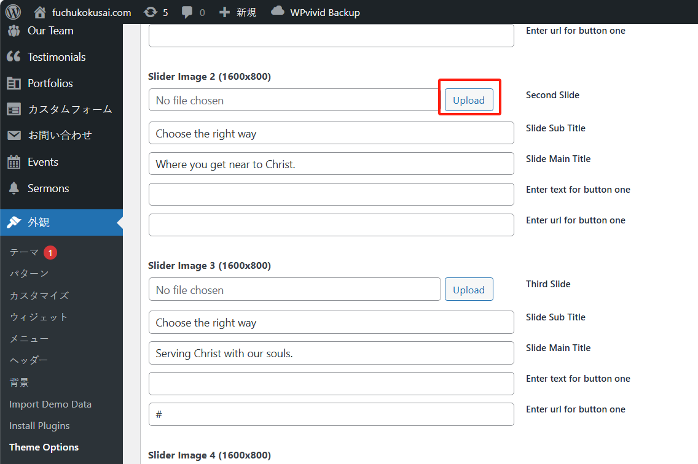

如果媒体库中没有，可以点击“ファイルをアップロード”按钮上传新的图片：

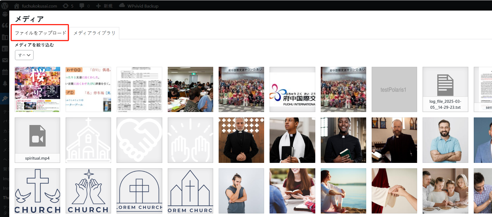

随后，选中需要的图片作为首页大图，点击“選択”按钮：

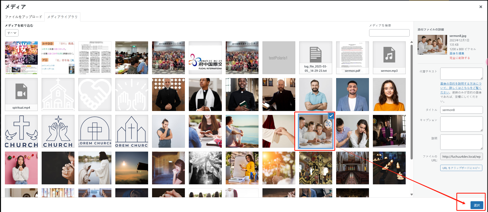

最后，点击页面下方的“Save Options”按钮进行保存！

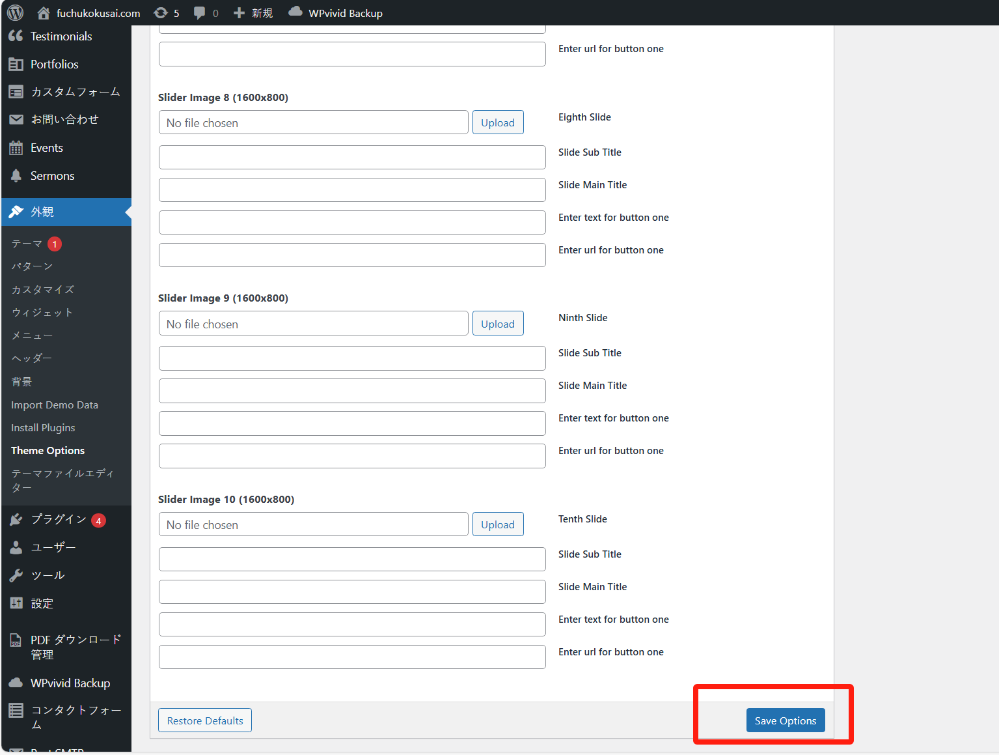
