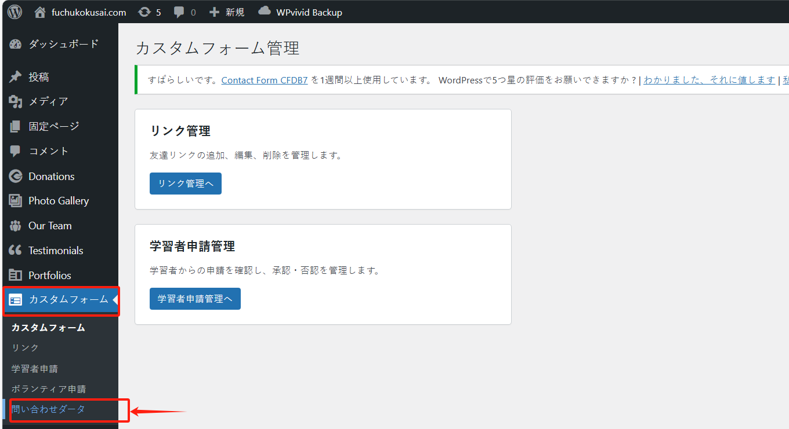
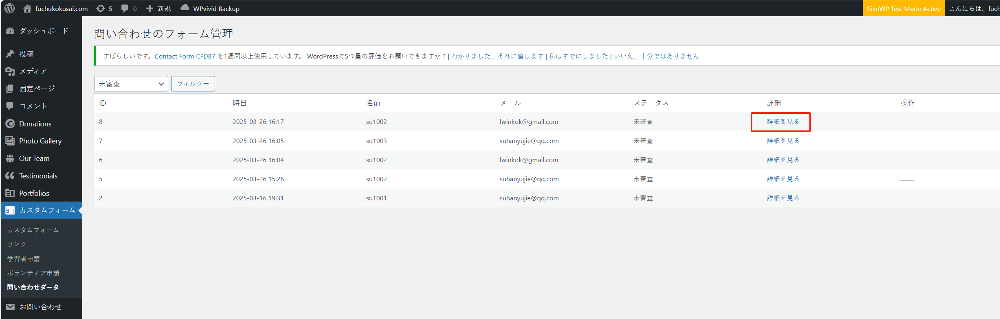
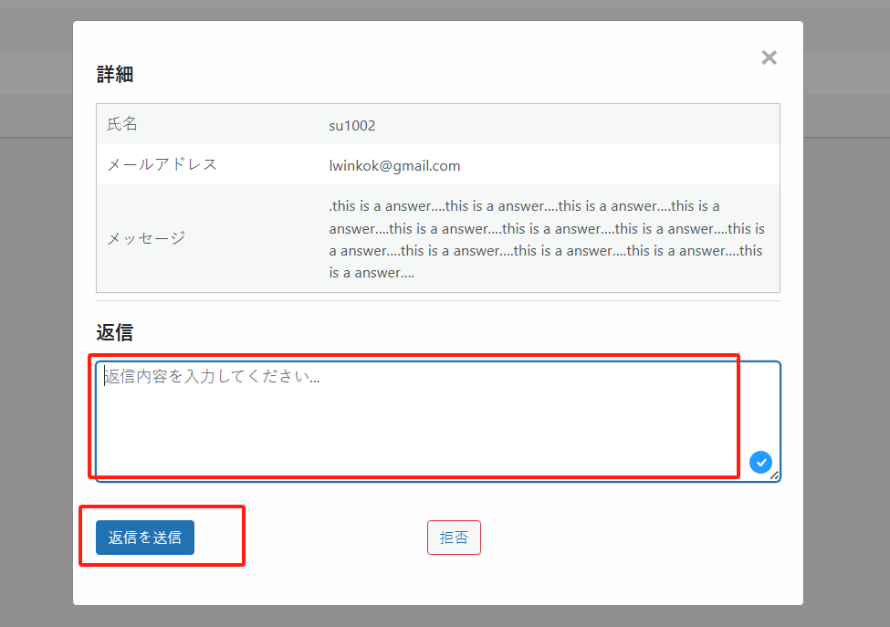
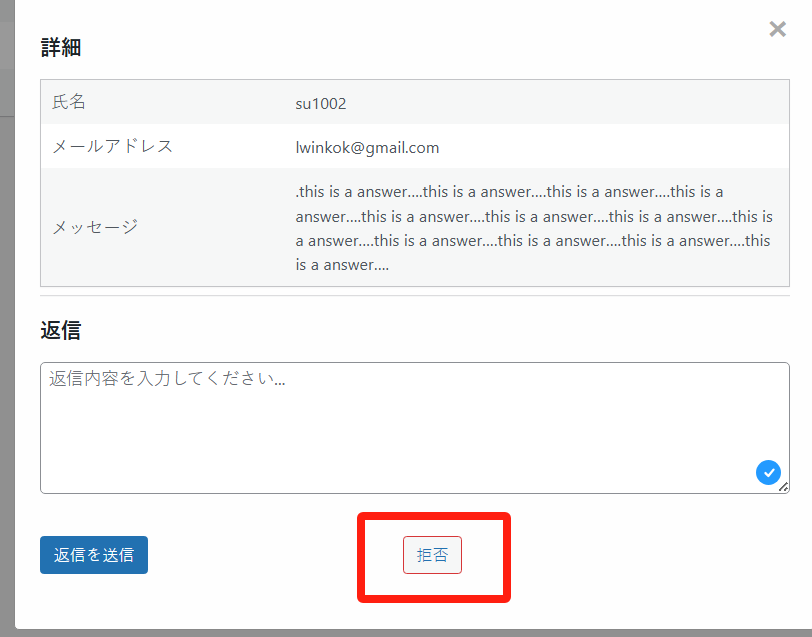

## 处理用户的咨询或者反馈（問い合わせ/feedback）

「お問い合わせ」是指用户通过网站提供的联系方式（如联系表单、邮件等）向网站管理者发起的咨询或反馈。

在我们的网站中，也有相关页面，如下所示，点击按钮，可以进入咨询页面：

用户可以填写表单，进行相关咨询：

当用户填写完表单后，网站管理员可以在管理后台查看用户提交的问题，并进行回复。

进入后台管理页面，先点击“カスタムフォーム”菜单，随后再点击“問い合わせダータ”菜单：

此时可以看到用户提交的咨询信息，点击“詳細を見る”按钮可以查看详细信息：

管理员可以在“返信”区域，填写回复内容，然后点击“返信 & 送信”按钮向“咨询问题的用户”发送邮件。

如果是无效的咨询，可以点击“拒否”按钮，进行清除：

